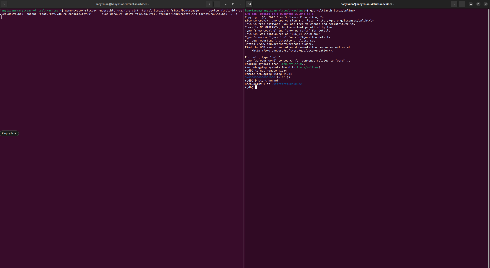

<br/>
<br/>
<br/>
<br/>
<br/>
<br/>
<br/>
<br/>
<br/>
<br/>
<br/>
<br/>

<center>
<center><font face="黑体" size = 100>
    《操作系统原理》实验报告
  </font></center>
  <br/>
<br/>
<br/>
<br/>
<br/>
<br/>
  <center><font face="黑体" size = 5>
    姓名：韩艺轩
  </font></center>
  <center><font face="黑体" size = 5>
    学院：计算机科学与技术学院
  </font></center>
  <center><font face="黑体" size = 5>
    专业：计算机科学与技术（图灵班）
  </font></center>
  <center><font face="黑体" size = 5>
    邮箱：2674361965@qq.com
  </font></center> 
  <center><font face="黑体" size = 5>
    指导教师：申文博
  </font></center>
</center>

<center>
<font face="黑体" size = 5>
    报告日期: 2023/09/23
  </font>
</center> 

<div STYLE="page-break-after: always;"></div>


# Lab0 GDB & QEMU 调试 64 位 RISC-V LINUX

## 搭建实验环境环境

首先安装编译内核所需要的交叉编译工具链和用于构建程序的软件包


安装用于启动 `riscv64` 平台上的内核的模拟器`qemu`


安装 `gdb` 对在 `qemu` 上运行的 `Linux` 内核进行调试


## 获取 Linux 源码和已经编译好的文件系统

从(https://www.kernel.org/)下载最新的Linux源码


使用`git`工具 `clone` 仓库`os23fall-stu`


## 编辑Linux内核

如图


## 使用 `QEMU` 运行内核

如图


## 使用 GDB 对内核进行调试

首先用第一个终端使用`QEMU`运行内核，运行时结尾加了`-s`表示启动`GDB`服务器，它会监听默认端口`1234`。`-S`表示在启动时暂停虚拟机，以便可以在`GDB`连接之前设置断点。然后在另一个终端启动`GDB`，并连接到端口`1234`



打下第一个断点，然后输入`continue`，发现内核运行到到断点处。


输入`quit`指令，退出`GDB`,内核运行完成。


## 思考题

### 编译与反汇编
```
使用 riscv64-linux-gnu-gcc 编译单个 .c 文件
使用 riscv64-linux-gnu-objdump 反汇编 1 中得到的编译产物
```
新建文件`a.c`内容如下

```c
#include <stdio.h>
int main(){
    printf("Hello ! OS !");
}
```
使用`riscv64-linux-gnu-gcc`编译后,使用`riscv64-linux-gnu-objdump`反汇编


### 调试内核时的操作

首先使用 `QEMU` 启动 `Linux`，在另一个终端使用 `GDB` 与 `QEMU` 远程通信（使用 `tcp::1234` 端口）进行调试,具体过程之前已经展示，不再赘述。

在 `GDB` 中查看汇编代码


在 0x80000000 处下断点,并查看所有已下的断点，然后在 0x80200000 处下断点，最终清除 0x80000000 处的断点


继续运行直到触发 0x80200000 处的断点


单步调试


最终退出`QEMU`

## 使用 `make` 工具清除 `Linux` 的构建产物


## `vmlinux` 和 `Image` 的关系和区别

区别：
```
vmlinux 是未压缩的 Linux 内核二进制文件，包含了完整的内核代码、数据和符号信息。它通常用于开发和调试目的，以便进行符号级别的调试。vmlinux 是编译内核时生成的主要输出文件，包括了所有的源代码和符号信息。

Image 是经过压缩的 Linux 内核映像文件，只包含内核的执行代码和数据，不包括调试信息和源代码。它是一个用于部署到实际硬件的内核映像，通常由引导加载程序（如 U-Boot）加载到内存中并执行。Image 文件是部署在嵌入式系统或生产环境中的内核映像。
```
关系：

```
Image 可以从 vmlinux 文件生成。通常，vmlinux 包含完整的内核信息，包括调试符号，而 Image 是经过压缩的轻量级内核映像，没有调试信息。在构建过程中，vmlinux 会被压缩成 Image，以减小内核映像的大小，以便在嵌入式系统上运行时占用更少的存储空间和内存。
```
