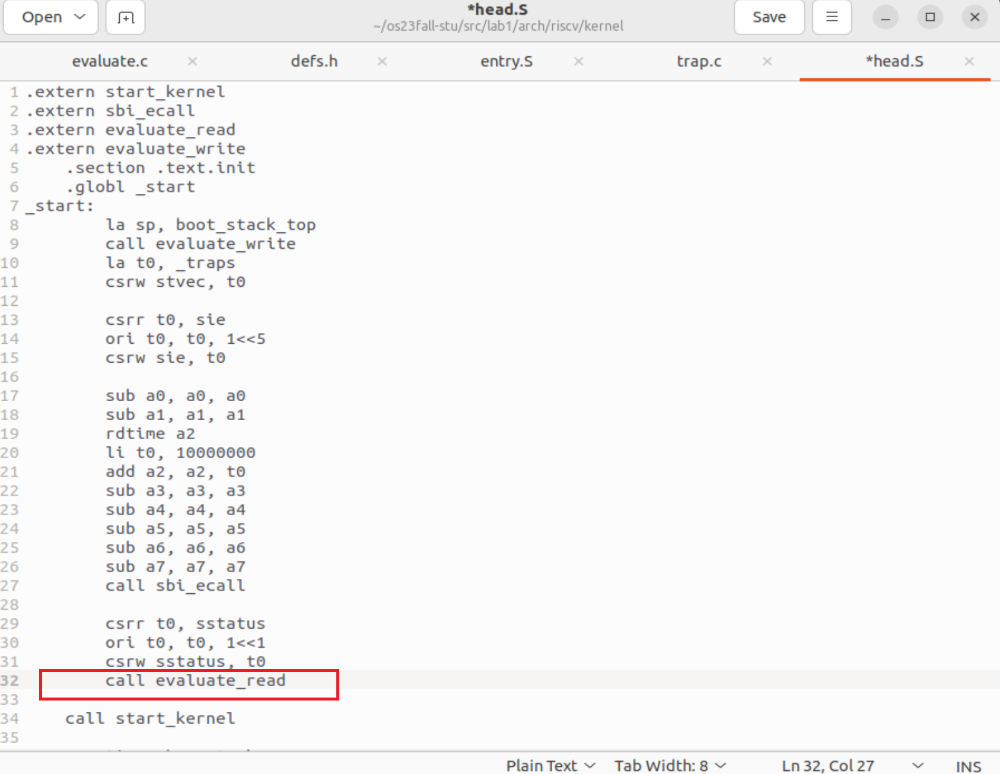
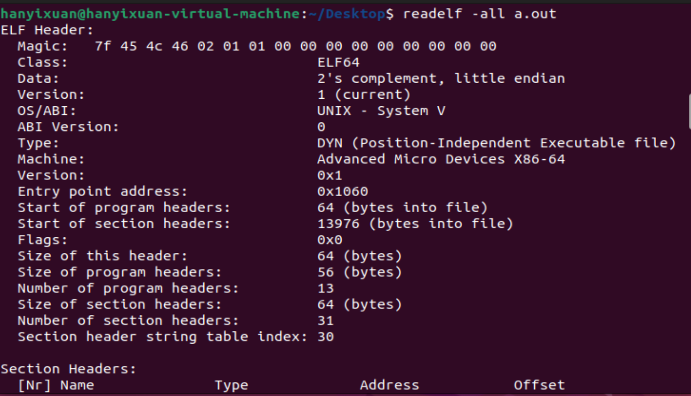
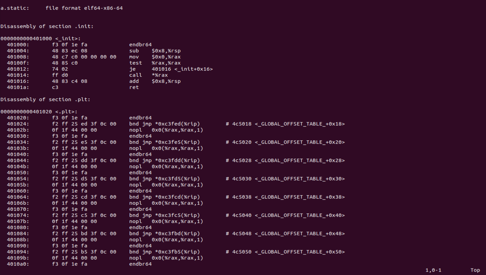

<br/>
<br/>
<br/>
<br/>
<br/>
<br/>
<br/>
<br/>
<br/>
<br/>
<br/>
<br/>

<center>
<center><font face="黑体" size = 100>
    《操作系统原理》实验报告
  </font></center>
  <br/>
<br/>
<br/>
<br/>
<br/>
<br/>
  <center><font face="黑体" size = 5>
    姓名：韩艺轩
  </font></center>
  <center><font face="黑体" size = 5>
    学院：计算机科学与技术学院
  </font></center>
  <center><font face="黑体" size = 5>
    专业：计算机科学与技术（图灵班）
  </font></center>
  <center><font face="黑体" size = 5>
    邮箱：2674361965@qq.com
  </font></center> 
  <center><font face="黑体" size = 5>
    指导教师：申文博
  </font></center>
</center>

<center>
<font face="黑体" size = 5>
    报告日期: 2023/10/20
  </font>
</center> 

<div STYLE="page-break-after: always;"></div>
<!-- TOC -->

- [实验步骤](#实验步骤)
  - [RV64 内核引导](#rv64-内核引导)
    - [编写 head.S](#编写-heads)
    - [完善 Makefile 脚本](#完善-makefile-脚本)
    - [补充 sbi.c](#补充-sbic)
    - [修改 defs.h](#修改-defsh)
  - [RV64时钟中断处理](#rv64时钟中断处理)
    - [修改 vmlinux.lds 和 head.S](#修改-vmlinuxlds-和-heads)
    - [开启 trap 处理](#开启-trap-处理)
    - [实现上下文切换](#实现上下文切换)
    - [实现 trap 处理函数](#实现-trap-处理函数)
    - [实现时钟中断相关函数](#实现时钟中断相关函数)
    - [编译即测试](#编译即测试)
- [思考题](#思考题)

<!-- /TOC -->

<div STYLE="page-break-after: always;"></div>


# 实验步骤

## RV64 内核引导

### 编写 head.S

首先为即将运行的第一个 C 函数设置程序栈（大小为4KB），并将该栈放置在.bss.stack 段。接下来通过跳转指令，跳转至 main.c 中的 start_kernel 函数。

```c
.extern start_kernel
.extern sbi_ecall
    .section .text.init
    .globl _start
_start:
    la sp, boot_stack_top
    call start_kernel
    .section .bss.stack
    .globl boot_stack
boot_stack:
    .space 4096 # <-- change to your stack size

    .globl boot_stack_top
boot_stack_top:
```

### 完善 Makefile 脚本

补充`lib/Makefile`, wildcard 使得通配符在变量定义时有效，C_SRC 表示所有 c文件 ，patsubst 函数用于将文件模式替换，即将 c文件 替换成 o文件。

```Makefile
C_SRC       = $(sort $(wildcard *.c))
OBJ		    = $(patsubst %.c,%.o,$(C_SRC))

file = printk.o
all:$(OBJ)
	
%.o:%.c
	${GCC} ${CFLAG} -c $<
clean:
	$(shell rm *.o 2>/dev/null)
```

### 补充 sbi.c

在 sbi_ecall 函数中，实现 
- 将 ext (Extension ID) 放入寄存器 a7 中，fid (Function ID) 放入寄存器 a6 中，将 arg0 ~ arg5 放入寄存器 a0 ~ a5 中。
- 使用 ecall 指令。
- OpenSBI 的返回结果会存放在寄存器 a0 ， a1 中，其中 a0 为 error code， a1 为返回值， 我们用 sbiret 来接受这两个返回值。

编写使用了内联汇编。
```c
struct sbiret sbi_ecall(int ext, int fid, uint64 arg0,
			            uint64 arg1, uint64 arg2,
			            uint64 arg3, uint64 arg4,
			            uint64 arg5) 
{
    struct sbiret ret;
    __asm__ volatile (
        "mv a7, %[ext]\n"
        "mv a6, %[fid]\n"
        "mv a0, %[arg0]\n"
        "mv a1, %[arg1]\n"
        "mv a2, %[arg2]\n"
        "mv a3, %[arg3]\n"
        "mv a4, %[arg4]\n"
        "mv a5, %[arg5]\n"
        "ecall\n"
        "mv %[ecall_error], a0\n"
        "mv %[ecall_value], a1\n"
        : [ecall_error] "=r" (ret.error), [ecall_value] "=r" (ret.value)
        : [ext] "r" (ext), [fid] "r" (fid), [arg0] "r" (arg0), [arg1] "r" (arg1),
        [arg2] "r" (arg2), [arg3] "r" (arg3), [arg4] "r" (arg4), [arg5] "r" (arg5)
        :"memory"
    );       
    return ret;
}
```

### 修改 defs.h

在 def.h 中补充 read_csr 宏定义，实现从控制状态寄存器读取的指令的宏定义。

```h
#define csr_read(csr)                       \
({                                          \
    register uint64 __v;                    \
    asm volatile ("csrr " "%0, " #csr        \  
                  :"=r" (__v):             \
                  :"memory");           \
    __v;                                    \
})
```
## RV64时钟中断处理

### 修改 vmlinux.lds 和 head.S

因为要加入对时钟中断的实现，所以需要简单修改 vmlinux.lds 和 head.S。在 vmlinux.lds 中，将中断处理逻辑放置在 .text.entry,原本的 _start 放置在 .text.init.

修改后的 vmlinux.lds

```c
/* 目标架构 */
OUTPUT_ARCH( "riscv" )

/* 程序入口 */
ENTRY( _start )

/* kernel代码起始位置 */
BASE_ADDR = 0x80200000;

SECTIONS
{
    /* . 代表当前地址 */
    . = BASE_ADDR;

    /* 记录kernel代码的起始地址 */
    _skernel = .;

    /* ALIGN(0x1000) 表示4KB对齐 */
    /* _stext, _etext 分别记录了text段的起始与结束地址 */
    .text : ALIGN(0x1000){
        _stext = .;
        *(.text.init)
        *(.text.entry)
        *(.text .text.*)
        
        _etext = .;
    }

    .rodata : ALIGN(0x1000){
        _srodata = .;

        *(.rodata .rodata.*)
        
        _erodata = .;
    }

    .data : ALIGN(0x1000){
        _sdata = .;

        *(.data .data.*)
        
        _edata = .;
    }

    .bss : ALIGN(0x1000){
        _sbss = .;

        *(.bss.stack)
        *(.sbss .sbss.*)
        *(.bss .bss.*)
        
        _ebss = .;
    }

    /* 记录kernel代码的结束地址 */
    _ekernel = .;
}
```

修改后的 head.S 

```c
.extern start_kernel
.extern sbi_ecall
    .section .text.init
    .globl _start
_start:
    la sp, boot_stack_top
    call start_kernel
    .section .bss.stack
    .globl boot_stack
boot_stack:
    .space 4096 # <-- change to your stack size

    .globl boot_stack_top
boot_stack_top:
```

### 开启 trap 处理

运行 start_kernel 之前，首先要设置 stvec ，将_trap表示的地址写入 stvec ,然后将 sie[SITE]置1，开启时钟中断，然后设置第一次时钟中断，最后开启S态下的中断响应。首先在 head.S 中进行修改。

首先设置栈空间

```c
    la sp, boot_stack_top
```

然后将 _trap 的基地址传给 stvec 寄存器

```c
    la t0, _traps
    csrw stvec, t0
```

接下来将sie的STIE位置1，由sie寄存器的结构可知：第6位是STIE位，所以使 0000000000100000 与 sie 的值做或操作，使得sie的第6位变成1.


```c
    csrr t0, sie
    ori t0, t0, 1<<5
    csrw sie, t0
```

然后调用 sbi_ecall 函数设置第一次中断，这里参考了函数 clock_set_next_event() 使用 rdtime 取得此刻时间，然后计算出下一个中断的时间，作为第三个参数传给 sbi_ecall ，其他参数都为0.

```c
    sub a0, a0, a0
    sub a1, a1, a1
    rdtime a2
    li t0, 10000000
    add a2, a2, t0
    sub a3, a3, a3
    sub a4, a4, a4
    sub a5, a5, a5
    sub a6, a6, a6
    sub a7, a7, a7
    call sbi_ecall

```

最后将 sstatus[SIE] 置1，根据 sstatus 的结构


```c
    csrr t0, sstatus
    ori t0, t0, 1<<1
    csrw sstatus, t0
```

使用与上述 sie 寄存器 STIE 置1相同的操作，使 sstatus[SIE] 置1.

然后再执行 start_kernel 函数。

### 实现上下文切换

上下文切换简单来说就是在进入中断处理函数之前将寄存器的状态保存下来，执行完中断后再复原。我们将实现上下文切换的部分放在 entry.S 中

在执行中断处理函数前首先要保存所有寄存器的值。

```c
	addi sp, sp, -264
	sd x0, 0(sp)
	sd x1, 8(sp)
	sd x2, 16(sp)
	sd x3, 24(sp)
	sd x4, 32(sp)
	sd x5, 40(sp)
	sd x6, 48(sp)
	sd x7, 56(sp)
	sd x8, 64(sp)
	sd x9, 72(sp)
	sd x10, 80(sp)
	sd x11, 88(sp)
	sd x12, 96(sp)
	sd x13, 104(sp)
	sd x14, 112(sp)
	sd x15, 120(sp)
	sd x16, 128(sp)
	sd x17, 136(sp)
	sd x18, 144(sp)
	sd x19, 152(sp)
	sd x20, 160(sp)
	sd x21, 168(sp)
	sd x22, 176(sp)
	sd x23, 184(sp)
	sd x24, 192(sp)
	sd x25, 200(sp)
	sd x26, 208(sp)
	sd x27, 216(sp)
	sd x28, 224(sp)
	sd x29, 232(sp)
	sd x30, 240(sp)
	sd x31, 248(sp)
	csrr t0, sepc
	sd t0, 256(sp)
```

在保存了寄存器的数据后，就可以调用中断处理程序了。因为中断处理程序需要两个参数输入，需要先将参数传入 a0，a1.

```c
	csrr a0, scause
	csrr a1, sepc
	call trap_handler
```

中断处理程序执行完后，就可以将事先保存的寄存器的值再写回去。

```c
        ld x0, 0(sp)
	ld x1, 8(sp)
	ld x3, 24(sp)
	ld x4, 32(sp)
	ld x5, 40(sp)
	ld x6, 48(sp)
	ld x7, 56(sp)
	ld x8, 64(sp)
	ld x9, 72(sp)
	ld x10, 80(sp)
	ld x11, 88(sp)
	ld x12, 96(sp)
	ld x13, 104(sp)
	ld x14, 112(sp)
	ld x15, 120(sp)
	ld x16, 128(sp)
	ld x17, 136(sp)
	ld x18, 144(sp)
	ld x19, 152(sp)
	ld x20, 160(sp)
	ld x21, 168(sp)
	ld x22, 176(sp)
	ld x23, 184(sp)
	ld x24, 192(sp)
	ld x25, 200(sp)
	ld x26, 208(sp)
	ld x27, 216(sp)
	ld x28, 224(sp)
	ld x29, 232(sp)
	ld x30, 240(sp)
	ld x31, 248(sp)
	ld t0, 256(sp)
	csrw sepc, t0
	ld x2, 16(sp)
	addi sp, sp, 264
```

最后从中断中返回即可。

```c
    sret
```

### 实现 trap 处理函数

我们在上一步中调用了中断处理函数，现在就来实现它。在 arc/riscv/kernel/ 添加 trap.c ，实现 trap_handler() 函数。过程中需要通过 scause 判断 trap 类型，如果是 interrupt ，在判断是否为 timer interrupt.如果是就输出一句话表示在 timer interrupt 中（本次实验只考虑timer interrupt）。函数中的 clock_set_next_event() 用于设置下一个中断（后续实现）。根据 scause 的结构：


以及 Exception Code:


可知，只有当第64位为1，并且第5位为1时才是 timer interrupt。在判断是通过 1UL 移相应位数后的数与寄存器的值 相与 后的值的某一位是否还为1来判断寄存器的值的某一位是否为1.

```c
void trap_handler(unsigned long scause, unsigned long sepc) {
    unsigned long temp = 1;
	if((scause&(temp<<63))==(temp<<63) && scause&(temp<<4)==(temp<<4)){
	    printk("Supervisor Timer Interrupt.\n");
	    clock_set_next_event();
	}
}
```

### 实现时钟中断相关函数

在 arch/riscv/kernel/ 目录下添加 clock.c 文件。并实现 get_cycles()用于使用 rdtime 指令获得当前 time 寄存器中的值，clock_set_next_event()用于调用 sbi_ecall() 来设置下一个时钟中断事件。

```c
// clock.c
#include "clock.h"
#include "sbi.h"
// QEMU中时钟的频率是10MHz, 也就是1秒钟相当于10000000个时钟周期。
unsigned long TIMECLOCK = 10000000;

unsigned long get_cycles() {
	unsigned long ret_val;
	__asm__ volatile (
		"rdtime %[ret_val]" 
		: [ret_val] "=r" (ret_val)
		:
		:                 );
		return ret_val;
}

void clock_set_next_event() {
    unsigned long next = get_cycles() + TIMECLOCK;
    sbi_ecall(0x0,0x0,next,0x0,0x0,0x0,0x0,0x0);
} 
```

### 编译即测试

以上所有步骤结束后，在linux根目录下执行 make run 指令查看结果。


# 思考题

1. 请总结一下 RISC-V 的 calling convention，并解释 Caller / Callee Saved Register 有什么区别？

- 参数传递：函数参数存储在通用寄存器 a0 到 a7 中。如果参数太多，超出了 a0-a7 的数量，额外的参数会存储在栈中。

- 返回值：函数的返回值通常存储在 a0 寄存器中，如果返回值较大，可能需要额外的寄存器或内存来存储。

- Caller Saved Registers：这些寄存器包括 t0 到 t6 和 a0 到 a7，它们用于存储函数调用时的临时数据。在函数调用前，调用者需要保存这些寄存器的值，以确保调用后可以恢复。

- Callee Saved Registers：这些寄存器包括 s0 到 s11 和 fp，它们用于存储函数调用期间需要保留的值。被调用的函数需要在函数开始时保存这些寄存器的值，然后在函数结束时还原它们的值。

- Caller / Callee Saved Register的区别：
  Caller Saved Registers：这些寄存器由函数的调用者保存和管理，因为它们在函数调用期间会被临时使用，调用者负责在函数调用前保存它们的值，以便在函数调用后还原。这些寄存器通常用于存储函数调用期间的临时数据，如临时变量和函数参数传递。
  Callee Saved Registers：这些寄存器由被调用者（即被调用的函数）保存和管理。它们用于存储被调用函数的临时数据，以确保在函数调用结束时能够还原这些值。通常，被调用者保存这些寄存器的值，然后在函数结束时还原它们，以确保不会影响调用者的寄存器状态。

2. 编译之后，通过 System.map 查看 vmlinux.lds 中自定义符号的值（截图）。


在 arch/riscv/kernel/ 目录下新建 evaluate.c 如下，用来验证思考题的第3题和第4题。在head.S的适当位置调用这两个函数，观察输出。
```c
#include "printk.h"
#include "clock.h"
#include "defs.h"

void evaluate_read(){
	uint64 ret = csr_read(sstatus);
	for(int i = 63;i >=0;i--){
	    if((ret&(1UL<<i)) == (1UL<<i)){
	    	printk("1");
	    }else{
	    	printk("0");
	    }
	    if(i%8 == 0){
	    	printk("_");
	    }
	}
	printk("\n");

}
void evaluate_write(){
	uint64 temp = 12138;
	csr_write(sscratch,temp);
	uint64 ret = csr_read(sscratch);
	if(ret == temp){
	    printk("The csr_write is right!\n");
	}else{
	    printk("The csr_write is wrong!\n");
	}

}
```

3. 用 csr_read 宏读取 sstatus 寄存器的值，对照 RISC-V 手册解释其含义（截图）。

在 head.S 中此处插入调用，运行观察输出。



该值为二进制 
```
10000000_00000000_00000000_00000000_00000000_00000000_01100000_00000010
```

根据 sstatus 的结构


SPP 位（位 8）为 0，表明在进入监管者模式之前，处理器是在用户模式下执行的。
SIE 位（位 1）为 1，表示监管者模式下的中断是启用的。
SPIE 位（位 5）为 0，表明在陷入监管者模式之前，没有启用监管者模式下的中断。

4. 用 csr_write 宏向 sscratch 寄存器写入数据，并验证是否写入成功（截图）

在 head.S 中加入调用 evaluate_write 。


运行后查看结果：


验证其正确。

5. Detail your steps about how to get arch/arm64/kernel/sys.i

安装交叉编译工具链


使用默认配置


进入linux目录下找到 sys.c 


生成 sys.i


6. Find system call table of Linux v6.0 for ARM32, RISC-V(32 bit), RISC-V(64 bit), x86(32 bit), x86_64 List source code file, the whole system call table with macro expanded, screenshot every step.

找到对应版本的 Linux sys_call_table 的文件。


- riscv32

使用riscv32的配置


生成 syscall_table.i 


查看 sys_call_table


- riscv64

使用 riscv64 的配置


生成syscall_table.i


查看 sys_call_table


- x86(64bit)

配置


生成 .i 文件


查看


- x86(32bit)

配置


生成 .i 文件


查看


- arm
在arm64的文件夹中有 sys32.c

配置


生成 .i 文件


查看


7. Explain what is ELF file? Try readelf and objdump command on an ELF file, give screenshot of the output. Run an ELF file and cat /proc/PID/maps to give its memory layout.

ELF文件是“可执行与可链接格式”的缩写，是一种常见的文件格式，用于Linux中存储可执行文件、目标代码、共享库和核心转储。ELF文件包含有关如何加载和执行程序的信息。

编写 a.c

```c
#include <stdio.h>

int main(){
    printf("Hello!OS!\n");
}
```

编译并查看文件类型


使用 readelf -all


使用 objdump




运行并且查看内存映射


8. 在我们使用make run时， OpenSBI 会产生如下输出:

```txt
    OpenSBI v0.9
     ____                    _____ ____ _____
    / __ \                  / ____|  _ \_   _|
   | |  | |_ __   ___ _ __ | (___ | |_) || |
   | |  | | '_ \ / _ \ '_ \ \___ \|  _ < | |
   | |__| | |_) |  __/ | | |____) | |_) || |_
    \____/| .__/ \___|_| |_|_____/|____/_____|
          | |
          |_|

    ......

    Boot HART MIDELEG         : 0x0000000000000222
    Boot HART MEDELEG         : 0x000000000000b109

    ......
```
通过查看 RISC-V Privileged Spec 中的 medeleg 和 mideleg ，解释上面 MIDELEG 值的含义。

medeleg 和 mideleg 属于 Machine Trap Delegation Registers，medeleg是 Machine exception delegation register，mideleg是 Machine interrupt delegation register。MIDELEG第 10、6、2 置 1，代表实现了虚拟机管理程序扩展（hypervisor extension）。