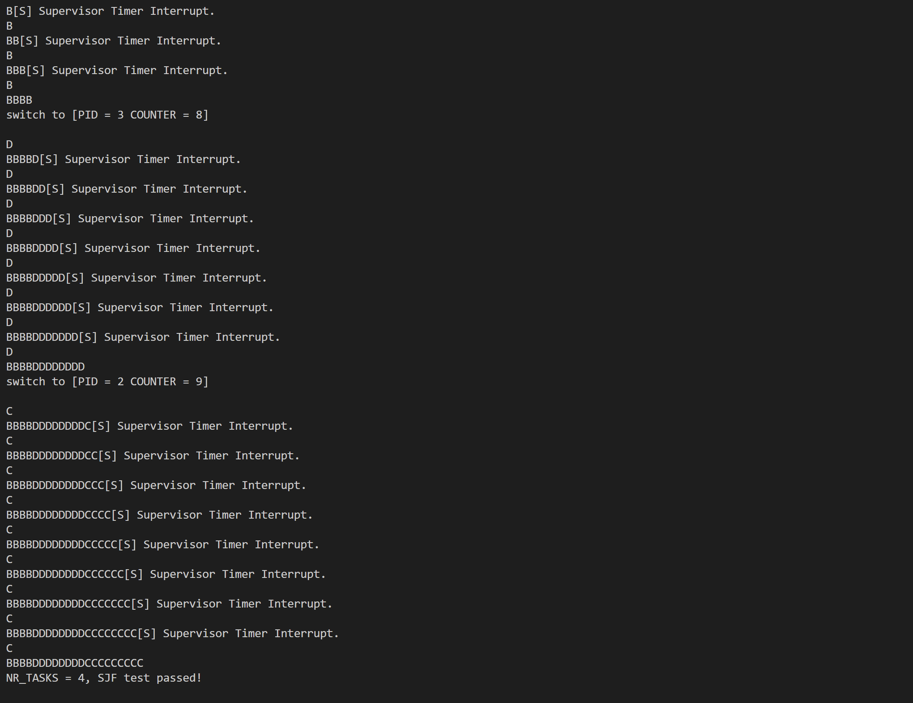
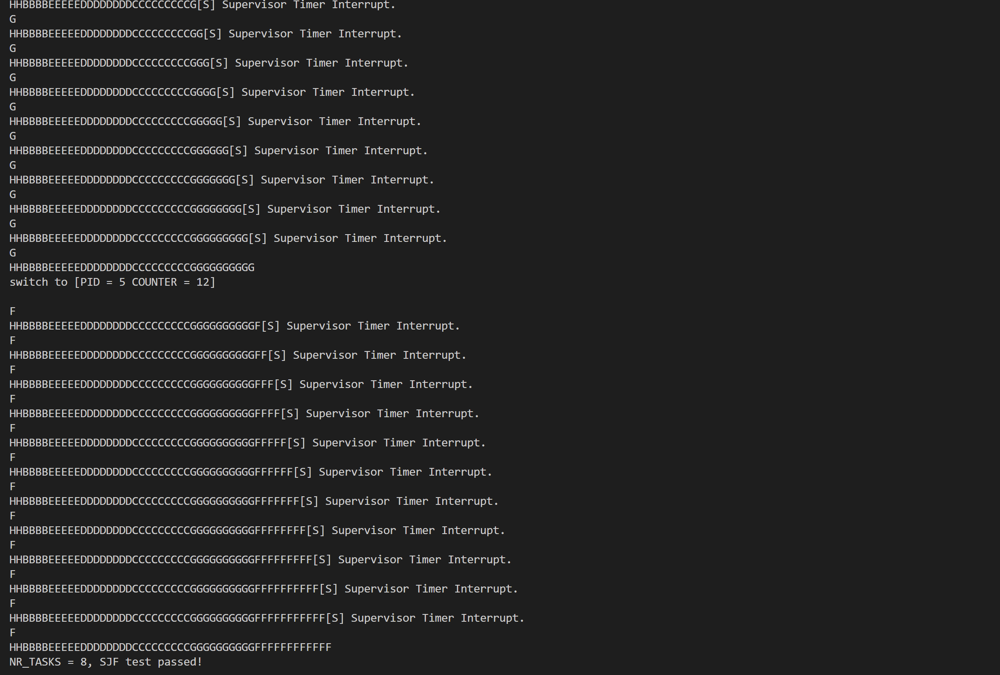
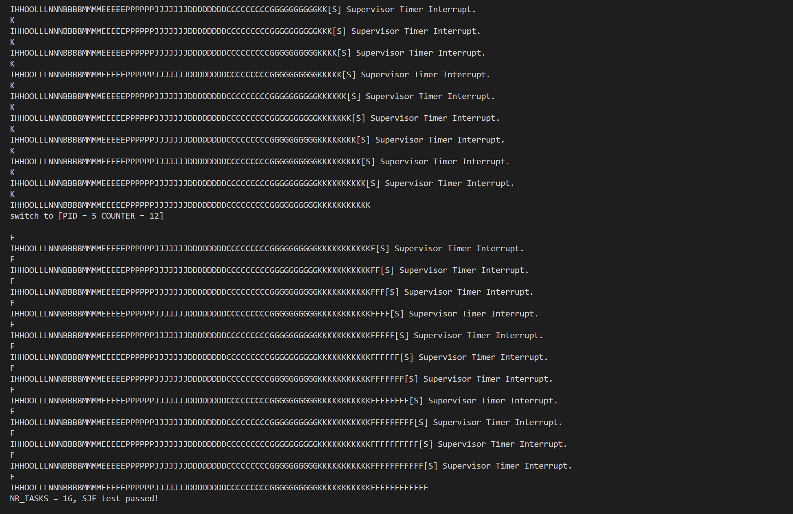
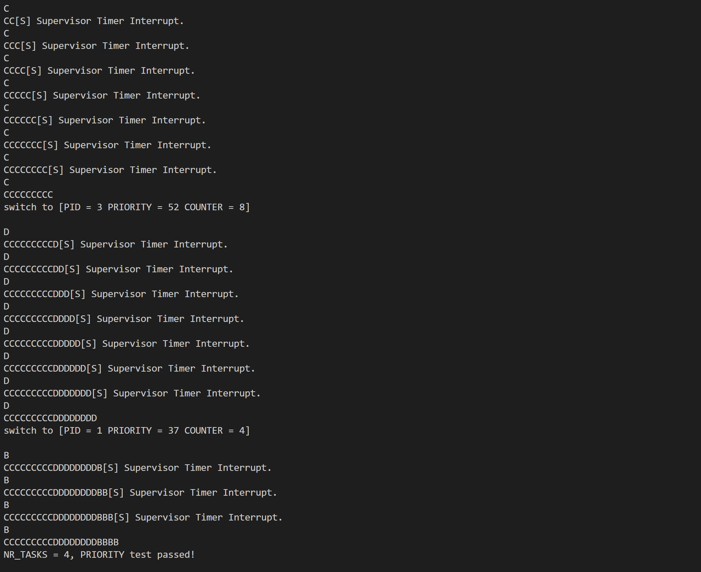
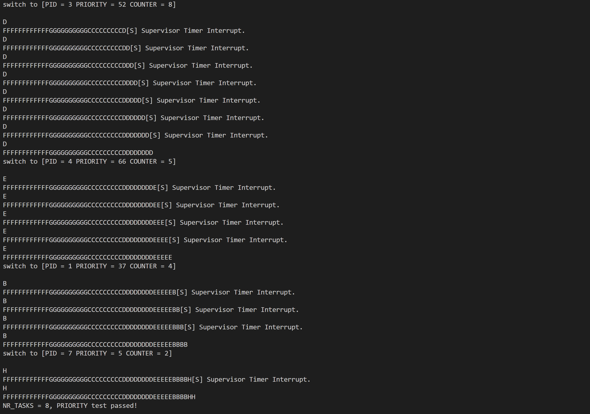
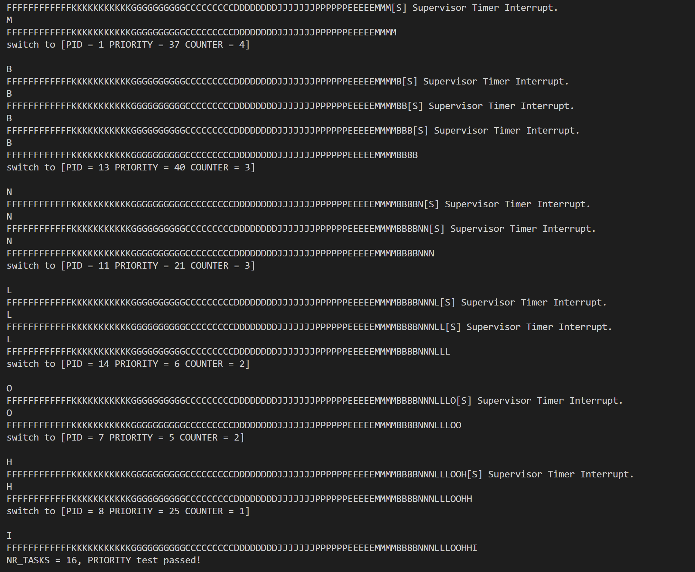
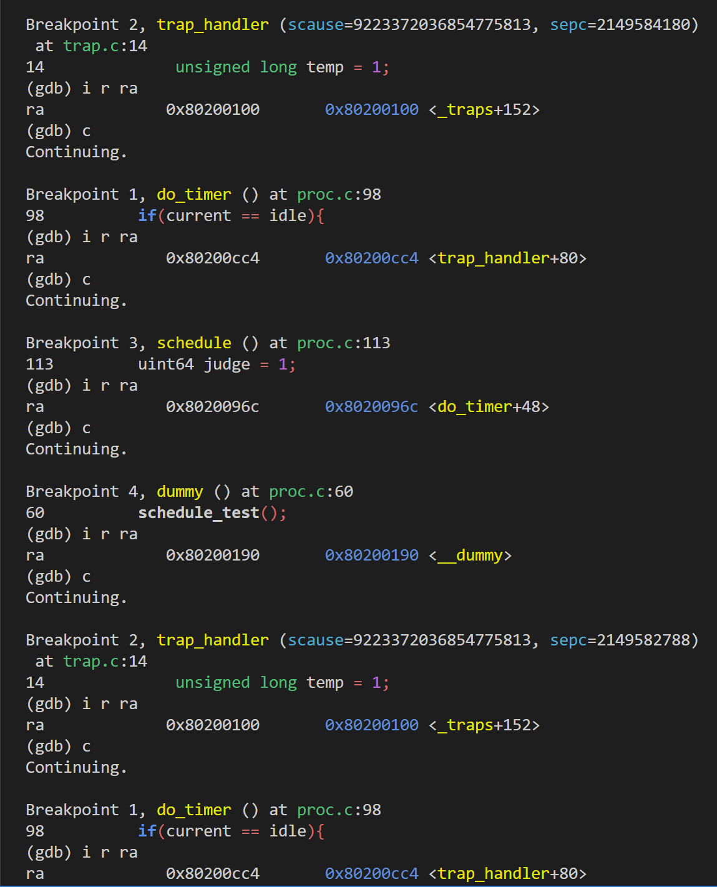
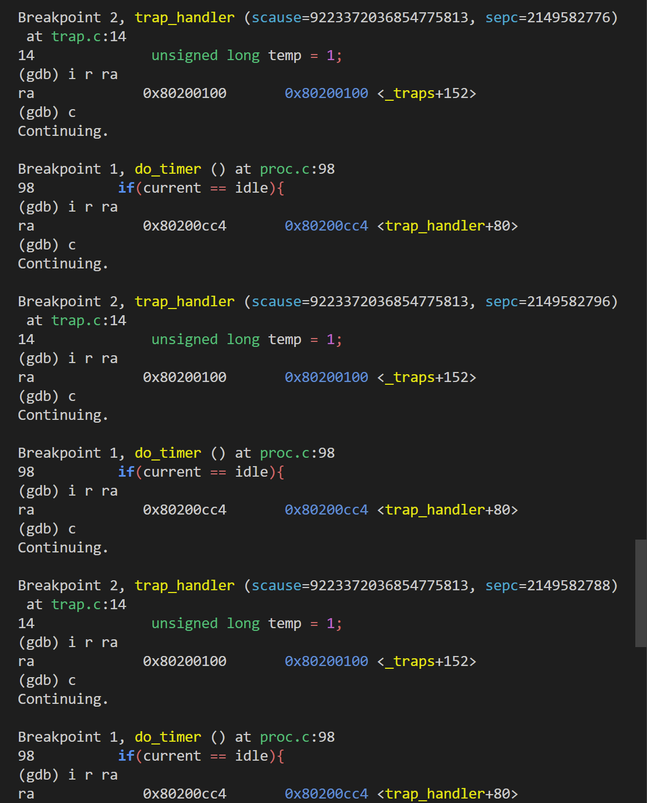
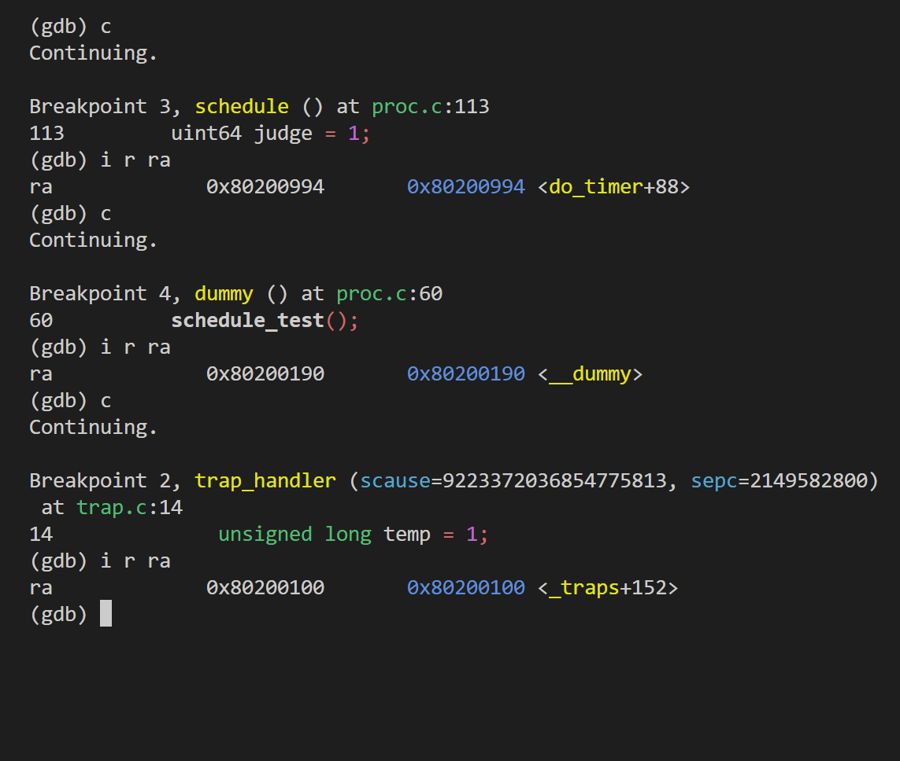

<br/>
<br/>
<br/>
<br/>
<br/>
<br/>
<br/>
<br/>
<br/>
<br/>
<br/>
<br/>

<center>
<center><font face="黑体" size = 100>
    《操作系统原理》实验报告
  </font></center>
  <br/>
<br/>
<br/>
<br/>
<br/>
<br/>
  <center><font face="黑体" size = 5>
    姓名：韩艺轩
  </font></center>
  <center><font face="黑体" size = 5>
    学院：计算机科学与技术学院
  </font></center>
  <center><font face="黑体" size = 5>
    专业：计算机科学与技术（图灵班）
  </font></center>
  <center><font face="黑体" size = 5>
    邮箱：2674361965@qq.com
  </font></center> 
  <center><font face="黑体" size = 5>
    指导教师：申文博
  </font></center>
</center>

<center>
<font face="黑体" size = 5>
    报告日期: 2023/10/26
  </font>
</center> 

<div STYLE="page-break-after: always;"></div>
<!-- TOC -->

- [实验步骤](#实验步骤)
  - [准备工作](#准备工作)
  - [proc.h 数据结构定义](#proch-数据结构定义)
  - [线程调度功能实现](#线程调度功能实现)
    - [线程初始化](#线程初始化)
    - [\_\_dummy 与 dummy](#__dummy-与-dummy)
    - [实现线程切换](#实现线程切换)
    - [实现调度入口函数](#实现调度入口函数)
    - [实现线程调度](#实现线程调度)
      - [短作业优先调度算法](#短作业优先调度算法)
      - [优先级调度算法](#优先级调度算法)
- [编译及测试](#编译及测试)
  - [测试 短作业优先调度算法](#测试-短作业优先调度算法)
    - [NR\_TASKS = 4](#nr_tasks--4)
    - [NR\_TASKS = 8](#nr_tasks--8)
    - [NR\_TASKS = 16](#nr_tasks--16)
  - [测试 优先级调度算法](#测试-优先级调度算法)
    - [NR\_TASKS = 4](#nr_tasks--4-1)
    - [NR\_TASKS = 8](#nr_tasks--8-1)
    - [NR\_TASKS = 16](#nr_tasks--16-1)
  - [运行 短作业优先调度算法](#运行-短作业优先调度算法)
  - [运行 优先级调度算法](#运行-优先级调度算法)
- [思考题](#思考题)

<!-- /TOC -->

<div STYLE="page-break-after: always;"></div>


# 实验步骤
## 准备工作

从 repo 同步以下代码: rand.h/rand.c，string.h/string.c，mm.h/mm.c，proc.h/proc.c，test.h/test_schedule.h，schedule_null.c/schedule_test.c 以及新增的一些 Makefile 的变化。

```
.
├── arch
│   └── riscv
│       ├── include
│       │   └── mm.h
|       |   └── proc.h
│       └── kernel
│           └── mm.c
|           └── proc.c
├── include
│   ├── rand.h
│   ├── string.h
|   ├── test.h
|   └── schedule_test.h
|
├── test
│   ├── schedule_null.c
│   ├── schedule_test.c
│   └── Makefile
|
├── lib
|   ├── rand.c
|   └── string.c
|
└── Makefile
```

修改 defs.h，在 defs.h 添加如下内容：

```c
#define PHY_START 0x0000000080000000
#define PHY_SIZE  128 * 1024 * 1024 // 128MB，QEMU 默认内存大小
#define PHY_END   (PHY_START + PHY_SIZE)

#define PGSIZE 0x1000 // 4KB
#define PGROUNDUP(addr) ((addr + PGSIZE - 1) & (~(PGSIZE - 1)))
#define PGROUNDDOWN(addr) (addr & (~(PGSIZE - 1)))
```

## proc.h 数据结构定义

对 proc.h 数据结构进行定义

```c
// arch/riscv/include/proc.h

#include "types.h"

// #define NR_TASKS  (1 + 31) // 用于控制 最大线程数量 （idle 线程 + 31 内核线程）
#define NR_TASKS  (1 + 3)
#define TASK_RUNNING    0 // 为了简化实验, 所有的线程都只有一种状态

#define PRIORITY_MIN 1
#define PRIORITY_MAX 10

/* 用于记录 `线程` 的 `内核栈与用户栈指针` */
/* (lab2 中无需考虑, 在这里引入是为了之后实验的使用) */
struct thread_info {
    uint64 kernel_sp;
    uint64 user_sp;
};

/* 线程状态段数据结构 */
struct thread_struct {
    uint64 ra;
    uint64 sp;
    uint64 s[12];
};

/* 线程数据结构 */
struct task_struct {
    struct thread_info thread_info;
    uint64 state;    // 线程状态
    uint64 counter;  // 运行剩余时间
    uint64 priority; // 运行优先级 1最低 10最高
    uint64 pid;      // 线程id

    struct thread_struct thread;
};

/* 线程初始化 创建 NR_TASKS 个线程 */
void task_init();

/* 在时钟中断处理中被调用 用于判断是否需要进行调度 */
void do_timer();

/* 调度程序 选择出下一个运行的线程 */
void schedule();

/* 线程切换入口函数*/
void switch_to(struct task_struct* next);

/* dummy funciton: 一个循环程序, 循环输出自己的 pid 以及一个自增的局部变量 */
void dummy();
```

## 线程调度功能实现

### 线程初始化

当我们的 OS run 起来的时候，其本身就是一个线程 idle 。第一步我们要为 idle 设置 task_struct。并将 current，task[0] 都指向 idle。
为了方便起见，我们将 task[1] ~ task[NR_TASKS - 1]，全部初始化，这里和 idle 设置的区别在于要为这些线程设置 thread_struct 中的 ra 和 sp.

完善 arch/riscv/kernel/proc.c

```c
void task_init() {
    test_init(NR_TASKS);

    idle = (struct task_struct *)kalloc();
    idle->state = TASK_RUNNING;
    idle->counter = 0;
    idle->priority = 0;
    idle->pid = 0;
    current = idle;
    task[0] = idle;

    for(uint64 i = 1;i<NR_TASKS;i++){
        task[i] = (struct task_struct *)kalloc();
        task[i]->state = TASK_RUNNING;
        task[i]->counter  = task_test_counter[i];
        task[i]->priority = task_test_priority[i];
        task[i]->pid = i;
        task[i]->thread.ra = (uint64)__dummy ;
        task[i]->thread.sp = (uint64)task[i] + PGSIZE ;
    }
    printk("...proc_init done!\n");
}
```

### __dummy 与 dummy

task[1] ~ task[NR_TASKS - 1]都运行同一段代码 dummy() 我们在 proc.c 添加 dummy():

```c
// arch/riscv/kernel/proc.c

void dummy() {
    schedule_test();
    uint64 MOD = 1000000007;
    uint64 auto_inc_local_var = 0;
    int last_counter = -1;
    while(1) {
        if ((last_counter == -1 || current->counter != last_counter) && current->counter > 0) {
            if(current->counter == 1){
                --(current->counter);   // forced the counter to be zero if this thread is going to be scheduled
            }                           // in case that the new counter is also 1，leading the information not printed.
            last_counter = current->counter;
            auto_inc_local_var = (auto_inc_local_var + 1) % MOD;
            printk("[PID = %d] is running. auto_inc_local_var = %d\n", current->pid, auto_inc_local_var);
        }
    }
}
```

当我们创建一个新的线程，此时线程的栈为空，当这个线程被调度时，是没有上下文需要被恢复的，所以我们需要为线程 第一次调度 提供一个特殊的返回函数 __dummy

在 entry.S 添加 __dummy

- 在__dummy 中将 sepc 设置为 dummy() 的地址，并使用 sret 从中断中返回。
- __dummy 与 _traps的 restore 部分相比，其实就是省略了从栈上恢复上下文的过程 ( 但是手动设置了 sepc )。

```c
__dummy:
	la t0, dummy
	csrw sepc, t0
	sret
```

### 实现线程切换

判断下一个执行的线程 next 与当前的线程 current 是否为同一个线程，如果是同一个线程，则无需做任何处理，否则调用 __switch_to 进行线程切换。

```c
// arch/riscv/kernel/proc.c

void switch_to(struct task_struct* next) {
    if((uint64)current != (uint64)next){
        struct task_struct *prev = current;
        current = next;
    #ifdef SJF
        printk("\n");
        printk("switch to [PID = %d COUNTER = %d]\n\n", current->pid, current->counter);
    #endif 

    #ifdef PRIORITY
        printk("\n");
        printk("switch to [PID = %d PRIORITY = %d COUNTER = %d]\n\n", current->pid, current->priority, current->counter);
    #endif
        __switch_to(prev, next);
    }
}
```

在 entry.S 中实现线程上下文切换 __switch_to:
- __switch_to接受两个 task_struct 指针作为参数保存当前线程的ra，sp，s0~s11到当前线程的 thread_struct 中
- 将下一个线程的 thread_struct 中的相关数据载入到ra，sp，s0~s11中。

```c
# arch/riscv/kernel/entry.S

__switch_to:
	sd ra, 48(a0)
	sd sp, 56(a0)
	sd s0, 64(a0)
	sd s1, 72(a0)
	sd s2, 80(a0)
	sd s3, 88(a0)
	sd s4, 96(a0)
	sd s5, 104(a0)
	sd s6, 112(a0)
	sd s7, 120(a0)
	sd s8, 128(a0)
	sd s9, 136(a0)
	sd s10, 144(a0)
	sd s11, 152(a0)

	ld ra, 48(a1)
	ld sp, 56(a1)
	ld s0, 64(a1)
	ld s1, 72(a1)
	ld s2, 80(a1)
	ld s3, 88(a1)
	ld s4, 96(a1)
	ld s5, 104(a1)
	ld s6, 112(a1)
	ld s7, 120(a1)
	ld s8, 128(a1)
	ld s9, 136(a1)
	ld s10, 144(a1)
	ld s11, 152(a1)
	
	ret
```

### 实现调度入口函数

实现 do_timer()

```c
void do_timer(void) {
    // 1. 如果当前线程是 idle 线程 直接进行调度
    // 2. 如果当前线程不是 idle 对当前线程的运行剩余时间减1 若剩余时间仍然大于0 则直接返回 否则进行调度

    if(current == idle){
        schedule();
    }else{
        if((signed long)(--(current->counter)) > 0 ){
            // printk("in do_timer COUNTER = %d\n",current->counter);
            return ;
        }else{
            schedule();
        }
    }

}
```

并在 时钟中断处理函数 中调用。

```c
void trap_handler(unsigned long scause, unsigned long sepc) {
    	unsigned long temp = 1;
	if((scause&(temp<<63))==(temp<<63) && scause&(temp<<4)==(temp<<4)){

	    clock_set_next_event();

        do_timer();
        
        printk("[S] Supervisor Timer Interrupt.\n");
	}
}
```

### 实现线程调度

实现两种调度算法：1.短作业优先调度算法，2.优先级调度算法。

#### 短作业优先调度算法

- 遍历线程指针数组task（不包括 idle ，即 task[0] ）， 在所有运行状态 （TASK_RUNNING） 下的线程运行剩余时间最少的线程作为下一个执行的线程。
- 如果所有运行状态下的线程运行剩余时间都为0，则对 task[1] ~ task[NR_TASKS-1] 的运行剩余时间重新赋值 （使用 rand()） ，之后再重新进行调度。

```c
// arch/riscv/kernel/proc.c 
// void schedule(void)

#ifdef SJF
    uint64 judge = 1;
    for(uint64 i = 1;i<NR_TASKS;i++){
        if(task[i]&&task[i]->counter != 0){
            judge = 0;
        }
    }
    if(judge){
        // printk("in schedule() task[i]->counter are all 0!\n");
        for(uint64 i=1;i<NR_TASKS;i++){
            if(task[i]) task[i]->counter = rand();
        }
    }
    uint64 min = -1;
    // printk("MIN == %d\n",min);
    uint64 index = 0;
    for(uint64 i = 1;i < NR_TASKS;i++){
        if(task[i]&&task[i]->counter < min && task[i]->state == TASK_RUNNING && task[i]->counter != 0){
            min = task[i]->counter;
            index = i;
        }
    }
    // printk("MIN ' == %d\n",min);
    // printk("index = %d\n",index);
    switch_to(task[index]);

#endif
```

#### 优先级调度算法

本算法实现参考了 Linux v0.11 调度算法实现 。

```c
// arch/riscv/kernel/proc.c
// void schedule(void)


#ifdef PRIORITY
        uint64 max = task[1]->counter;
        uint64 index = 1;
    while(1){
        for(uint64 i=1;i<NR_TASKS;i++){
            if(task[i] && task[i]->counter > max && task[i]->state == TASK_RUNNING){
                max = task[i]->counter;
                index = i;
            }
        }
        if(max) break;
        for(uint64 i = 1;i<NR_TASKS;i++){
            if(task[i]){
                task[i] ->counter = (task[i]->counter >> 1) + task[i]->priority;
            }
        }
    }
    // printk("index == %d\n",index);
    switch_to(task[index]);
#endif
```

# 编译及测试

## 测试 短作业优先调度算法

### NR_TASKS = 4



### NR_TASKS = 8



### NR_TASKS = 16



## 测试 优先级调度算法

### NR_TASKS = 4



### NR_TASKS = 8



### NR_TASKS = 16



## 运行 短作业优先调度算法

```txt
OpenSBI v0.9
   ____                    _____ ____ _____
  / __ \                  / ____|  _ \_   _|
 | |  | |_ __   ___ _ __ | (___ | |_) || |
 | |  | | '_ \ / _ \ '_ \ \___ \|  _ < | |
 | |__| | |_) |  __/ | | |____) | |_) || |_
  \____/| .__/ \___|_| |_|_____/|____/_____|
        | |
        |_|

Platform Name             : riscv-virtio,qemu
Platform Features         : timer,mfdeleg
Platform HART Count       : 1
Firmware Base             : 0x80000000
Firmware Size             : 100 KB
Runtime SBI Version       : 0.2

Domain0 Name              : root
Domain0 Boot HART         : 0
Domain0 HARTs             : 0*
Domain0 Region00          : 0x0000000080000000-0x000000008001ffff ()
Domain0 Region01          : 0x0000000000000000-0xffffffffffffffff (R,W,X)
Domain0 Next Address      : 0x0000000080200000
Domain0 Next Arg1         : 0x0000000087000000
Domain0 Next Mode         : S-mode
Domain0 SysReset          : yes

Boot HART ID              : 0
Boot HART Domain          : root
Boot HART ISA             : rv64imafdcsu
Boot HART Features        : scounteren,mcounteren,time
Boot HART PMP Count       : 16
Boot HART PMP Granularity : 4
Boot HART PMP Address Bits: 54
Boot HART MHPM Count      : 0
Boot HART MHPM Count      : 0
Boot HART MIDELEG         : 0x0000000000000222
Boot HART MEDELEG         : 0x000000000000b109
...mm_init done!
...proc_init done!
2023 Hello RISC-V

switch to [PID = 1 COUNTER = 4]

[PID = 1] is running. auto_inc_local_var = 1
[COUNTER = 4]
[S] Supervisor Timer Interrupt.
[PID = 1] is running. auto_inc_local_var = 2
[COUNTER = 3]
[S] Supervisor Timer Interrupt.
[PID = 1] is running. auto_inc_local_var = 3
[COUNTER = 2]
[S] Supervisor Timer Interrupt.
[PID = 1] is running. auto_inc_local_var = 4
[COUNTER = 0]

switch to [PID = 3 COUNTER = 8]

[PID = 3] is running. auto_inc_local_var = 1
[COUNTER = 8]
[S] Supervisor Timer Interrupt.
[PID = 3] is running. auto_inc_local_var = 2
[COUNTER = 7]
[S] Supervisor Timer Interrupt.
[PID = 3] is running. auto_inc_local_var = 3
[COUNTER = 6]
[S] Supervisor Timer Interrupt.
[PID = 3] is running. auto_inc_local_var = 4
[COUNTER = 5]
[S] Supervisor Timer Interrupt.
[PID = 3] is running. auto_inc_local_var = 5
[COUNTER = 4]
[S] Supervisor Timer Interrupt.
[PID = 3] is running. auto_inc_local_var = 6
[COUNTER = 3]
[S] Supervisor Timer Interrupt.
[PID = 3] is running. auto_inc_local_var = 7
[COUNTER = 2]
[S] Supervisor Timer Interrupt.
[PID = 3] is running. auto_inc_local_var = 8
[COUNTER = 0]

switch to [PID = 2 COUNTER = 9]

[PID = 2] is running. auto_inc_local_var = 1
[COUNTER = 9]
[S] Supervisor Timer Interrupt.
[PID = 2] is running. auto_inc_local_var = 2
[COUNTER = 8]
[S] Supervisor Timer Interrupt.
[PID = 2] is running. auto_inc_local_var = 3
[COUNTER = 7]
[S] Supervisor Timer Interrupt.
[PID = 2] is running. auto_inc_local_var = 4
[COUNTER = 6]
[S] Supervisor Timer Interrupt.
[PID = 2] is running. auto_inc_local_var = 5
[COUNTER = 5]
[S] Supervisor Timer Interrupt.
[PID = 2] is running. auto_inc_local_var = 6
[COUNTER = 4]
[S] Supervisor Timer Interrupt.
[PID = 2] is running. auto_inc_local_var = 7
[COUNTER = 3]
[S] Supervisor Timer Interrupt.
[PID = 2] is running. auto_inc_local_var = 8
[COUNTER = 2]
[S] Supervisor Timer Interrupt.
[PID = 2] is running. auto_inc_local_var = 9
[COUNTER = 0]

switch to [PID = 0 COUNTER = 0]

[S] Supervisor Timer Interrupt.
[S] Supervisor Timer Interrupt.
······
```

## 运行 优先级调度算法

```txt
Launch the qemu ......

OpenSBI v0.9
   ____                    _____ ____ _____
  / __ \                  / ____|  _ \_   _|
 | |  | |_ __   ___ _ __ | (___ | |_) || |
 | |  | | '_ \ / _ \ '_ \ \___ \|  _ < | |
 | |__| | |_) |  __/ | | |____) | |_) || |_
  \____/| .__/ \___|_| |_|_____/|____/_____|
        | |
        |_|

Platform Name             : riscv-virtio,qemu
Platform Features         : timer,mfdeleg
Platform HART Count       : 1
Firmware Base             : 0x80000000
Firmware Size             : 100 KB
Runtime SBI Version       : 0.2

Domain0 Name              : root
Domain0 Boot HART         : 0
Domain0 HARTs             : 0*
Domain0 Region00          : 0x0000000080000000-0x000000008001ffff ()
Domain0 Region01          : 0x0000000000000000-0xffffffffffffffff (R,W,X)
Domain0 Next Address      : 0x0000000080200000
Domain0 Next Arg1         : 0x0000000087000000
Domain0 Next Mode         : S-mode
Domain0 SysReset          : yes

Boot HART ID              : 0
Boot HART Domain          : root
Boot HART ISA             : rv64imafdcsu
Boot HART Features        : scounteren,mcounteren,time
Boot HART PMP Count       : 16
Boot HART PMP Granularity : 4
Boot HART PMP Address Bits: 54
Boot HART MHPM Count      : 0
Boot HART MHPM Count      : 0
Boot HART MIDELEG         : 0x0000000000000222
Boot HART MEDELEG         : 0x000000000000b109
...mm_init done!
...proc_init done!
2023 Hello RISC-V

switch to [PID = 2 PRIORITY = 88 COUNTER = 9]

[PID = 2] is running. auto_inc_local_var = 1
[COUNTER = 9]
[S] Supervisor Timer Interrupt.
[PID = 2] is running. auto_inc_local_var = 2
[COUNTER = 8]
[S] Supervisor Timer Interrupt.
[PID = 2] is running. auto_inc_local_var = 3
[COUNTER = 7]
[S] Supervisor Timer Interrupt.
[PID = 2] is running. auto_inc_local_var = 4
[COUNTER = 6]
[S] Supervisor Timer Interrupt.
[PID = 2] is running. auto_inc_local_var = 5
[COUNTER = 5]
[S] Supervisor Timer Interrupt.
[PID = 2] is running. auto_inc_local_var = 6
[COUNTER = 4]
[S] Supervisor Timer Interrupt.
[PID = 2] is running. auto_inc_local_var = 7
[COUNTER = 3]
[S] Supervisor Timer Interrupt.
[PID = 2] is running. auto_inc_local_var = 8
[COUNTER = 2]
[S] Supervisor Timer Interrupt.

······
```

# 思考题

1.在 RV64 中一共用 32 个通用寄存器，为什么 context_switch 中只保存了14个?

- 首先出于性能和资源管理的考虑。在进行上下文切换时，保存和恢复所有32个通用寄存器的状态可能会导致不必要的开销。

- 在上下文切换过程中，只需要保存和恢复那些在函数调用期间被破坏的寄存器，以确保被调用函数的状态不受影响。这通常包括保存调用者保存寄存器和一些其他需要的寄存器。

- RV64架构通常定义了哪些寄存器是调用者保存的，哪些是被调用者保存的。调用者保存寄存器通常在函数调用前被保存，函数调用结束后再恢复，以保护调用者的上下文。被调用者保存寄存器则由被调用的函数负责保存和恢复。

- 所以，context_switch可能只保存了需要在上下文切换期间保护的寄存器，而其他的寄存器可以在被调用的函数中负责保存和恢复。

2.当线程第一次调用时，其 ra 所代表的返回点是 __dummy。那么在之后的线程调用中 context_switch 中，ra 保存/恢复的函数返回点是什么呢? 请同学用 gdb 尝试追踪一次完整的线程切换流程，并关注每一次 ra 的变换 (需要截图)。

首先会先进入 trap_handler 函数,此时 ra 记录调用 trap_handler 的下一条指令，然后在 trap_handler 中调用 do_timer 函数，ra 是调用 do_timer 的下一条指令。然后在 do_timer 中因为 current 是 idle ，所以要进行调度，调用 schedule 函数，ra 变成调用 schedule 的下一条指令，然后进入 dummy 函数，ra 为 __dummy 的地址，完成第一次调用，然后 ra 逐个恢复，使程序依次回到schedule(),do_timer(),trap_handler(),然后再次调用 trap_handler().





第一个进程调用第二个进程过程基本相同，唯一不同的地方在于 do_timer() 中调用 schedule() 的地方不同了，所以 ra 保存略有偏差。

