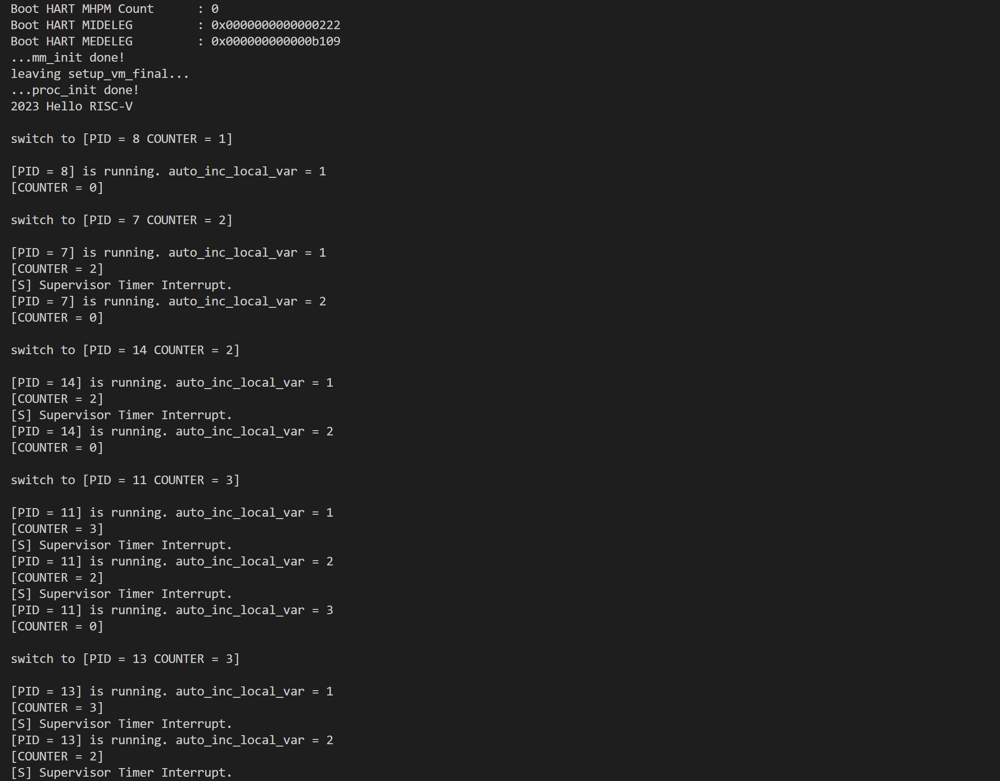
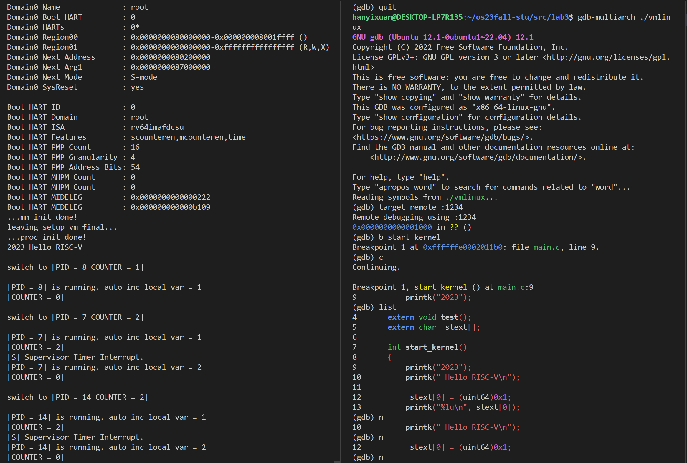
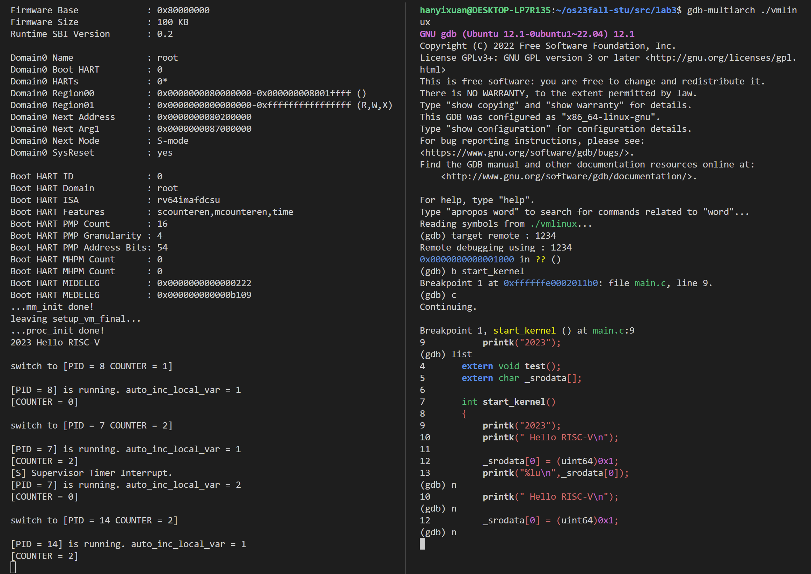

<br/>
<br/>
<br/>
<br/>
<br/>
<br/>
<br/>
<br/>
<br/>
<br/>
<br/>
<br/>

<center>
<center><font face="黑体" size = 100>
    《操作系统原理》实验报告
  </font></center>
  <br/>
<br/>
<br/>
<br/>
<br/>
<br/>
  <center><font face="黑体" size = 5>
    姓名：韩艺轩
  </font></center>
  <center><font face="黑体" size = 5>
    学院：计算机科学与技术学院
  </font></center>
  <center><font face="黑体" size = 5>
    专业：计算机科学与技术（图灵班）
  </font></center>
  <center><font face="黑体" size = 5>
    邮箱：2674361965@qq.com
  </font></center> 
  <center><font face="黑体" size = 5>
    指导教师：申文博
  </font></center>
</center>

<center>
<font face="黑体" size = 5>
    报告日期: 2023/11/20
  </font>
</center> 

<div STYLE="page-break-after: always;"></div>
<!-- TOC -->

- [Lab3-RV64 虚拟内存管理](#lab3-rv64-虚拟内存管理)
  - [实验步骤](#实验步骤)
    - [准备工作](#准备工作)
    - [开启虚拟内存映射](#开启虚拟内存映射)
      - [实现 `setup_vm`](#实现-setup_vm)
      - [实现`setup_vm_final`](#实现setup_vm_final)
      - [实现`create_mapping`](#实现create_mapping)
  - [实验结果](#实验结果)
  - [思考题](#思考题)

<!-- /TOC -->

<div STYLE="page-break-after: always;"></div>


# Lab3-RV64 虚拟内存管理

## 实验步骤

### 准备工作

- 在 defs.h 添加如下内容：

```c
#define OPENSBI_SIZE (0x200000)

#define VM_START (0xffffffe000000000)
#define VM_END   (0xffffffff00000000)
#define VM_SIZE  (VM_END - VM_START)

#define PA2VA_OFFSET (VM_START - PHY_START)
```

- 从 repo 同步以下代码: vmlinux.lds。并按照以下步骤将这些文件正确放置。

```txt
.
└── arch
    └── riscv
        └── kernel
            └── vmlinux.lds
```
新的链接脚本中的 ramv 代表 VMA ( Virtual Memory Address ) 即虚拟地址，ram 则代表 LMA ( Load Memory Address )，即我们 OS image 被 load 的地址，可以理解为物理地址。使用以上的 vmlinux.lds 进行编译之后，得到的 System.map 以及 vmlinux 中的符号采用的都是虚拟地址，方便之后 Debug。

- 从本实验开始我们需要使用刷新缓存的指令扩展，并自动在编译项目前执行 clean 任务来防止对头文件的修改无法触发编译任务。在项目顶层目录的 Makefile 中需要做如下更改：

```Makefile
# Makefile
...
ISA=rv64imafd_zifencei
...
all: clean
    ${MAKE} -C lib all
    ${MAKE} -C test all
    ${MAKE} -C init all
    ${MAKE} -C arch/riscv all
    @echo -e '\n'Build Finished OK
...
```

### 开启虚拟内存映射

在 RISC-V 中开启虚拟地址被分为了两步：setup_vm 以及 setup_vm_final，下面将介绍相关的具体实现。

#### 实现 `setup_vm`

将 `0x80000000` 开始的 `1GB` 区域进行两次映射，其中一次是等值映射 ( `PA == VA` ) ，另一次是将其映射到 `direct mapping area` ( 使得 `PA + PV2VA_OFFSET == VA` )。

对于函数 `setup_vm` 的实现，我们需要根据如下的两次映射将 0x80200000 开始的 1GB 区域进行两次映射：

```txt
Physical Address
-------------------------------------------
                     | OpenSBI | Kernel |
-------------------------------------------
                     ↑
                0x80000000
                     ├───────────────────────────────────────────────────┐
                     |                                                   |
Virtual Address      ↓                                                   ↓
-----------------------------------------------------------------------------------------------
                     | OpenSBI | Kernel |                                | OpenSBI | Kernel |
-----------------------------------------------------------------------------------------------
                     ↑                                                   ↑
                0x80000000                                       0xffffffe000000000
```

因为要映射 1GB 的区域，因为$1GB = 2^{30} bit$，所以`vpn2`右边的 30 位刚好可以表示 1GB 的空间，所以可以将 vpn2 作为 index ，将物理地址改写成 entry 的格式填入顶级页表中,物理地址与 0x0000007fc0000000 做与操作就可以使除 vpn2 的其他位变为0。Page Table Entry 的权限 `V | R | W | X` 位设置为 `1`，与 0xf 做或操作可以设置权限.

```c
// arch/riscv/kernel/vm.c
unsigned long  early_pgtbl[512] __attribute__((__aligned__(0x1000)));

void setup_vm() {
//    printk("Setup_vm...\n");
   memset(early_pgtbl, 0x0, PGSIZE);
   uint64 vpn2 = (PHY_START & 0x0000007fc0000000) >> 30;
   early_pgtbl[vpn2] = ((PHY_START >> 30) << 28) | 0xf;
   vpn2 = (VM_START & 0x0000007fc0000000) >> 30;
   early_pgtbl[vpn2] = ((PHY_START >> 30) << 28) | 0xf;
//    printk("leaving setup_vm...\n");
   return ;
}
```

完成上述映射之后，通过 `relocate` 函数，完成对 `satp` 的设置，以及跳转到对应的虚拟地址。`0xffffffdf80000000`是 `VM_START - PHY_START`的值，在 relocate 中，我们将 ra 和 sp 都映射到虚拟地址。对于`early_pgtbl`,它的地址目前是虚拟地址，但是要将物理地址写入`satp`，所以需要减去`0xffffffdf80000000`
```c
// head.S

.global relocate
relocate:

    li t0, 0xffffffdf80000000
    add ra, ra, t0
    add sp, sp, t0

    la t0, early_pgtbl
    li t1, 0xffffffdf80000000
    sub t0, t0, t1
    srli t0, t0, 12
    li t1, 8
    slli t1, t1, 60
    or t0, t0, t1
    csrw satp, t0

    sfence.vma zero, zero

    fence.i

    ret
```
至此我们已经完成了虚拟地址的开启，之后我们运行的代码也都将在虚拟地址上运行。

#### 实现`setup_vm_final`

由于 `setup_vm_final` 中需要申请页面的接口，应该在其之前完成内存管理初始化，需要修改`mm.c`中的代码，`mm.c`中初始化的函数接收的起始结束地址需要调整为虚拟地址。

```c
void mm_init(void) {
    kfreerange(_ekernel, (char *)(PHY_END + PA2VA_OFFSET));
    printk("...mm_init done!\n");
}
```

现在代码已经在虚拟地址运行，完成`setup_vm_final`,将完成对`kernel`的映射。函数内主要是对`create_mapping`的调用，完善三级页表的构建。然后修改`satp`，同样要修改成物理地址后再存入`satp`。

```c
// arch/riscv/kernel/vm.c
extern uint64 _stext;
extern uint64 _etext;
extern uint64 _srodata;
extern uint64 _erodata;
extern uint64 _sdata;
extern uint64 _edata;
unsigned long  swapper_pg_dir[512] __attribute__((__aligned__(0x1000)));

void setup_vm_final() {
    // printk("Setup_vm_final...\n");
    memset(swapper_pg_dir, 0x0, PGSIZE);
    // No OpenSBI mapping required

    // mapping kernel text X|-|R|V
    uint64 va = VM_START + OPENSBI_SIZE;
    uint64 pa = PHY_START + OPENSBI_SIZE;
    create_mapping(swapper_pg_dir, va, pa, (uint64)_srodata-(uint64)_stext, 0xb);

    // mapping kernel rodata -|-|R|V
    va += (uint64)_srodata-(uint64)_stext;
    pa += (uint64)_srodata-(uint64)_stext;
    create_mapping(swapper_pg_dir, va, pa, (uint64)_sdata-(uint64)_srodata, 0x3);

    // mapping other memory -|W|R|V
    va += (uint64)_sdata-(uint64)_srodata;
    pa += (uint64)_sdata-(uint64)_srodata;
    create_mapping(swapper_pg_dir, va, pa, PHY_SIZE - ((uint64)_sdata - (uint64)_stext), 0x7);

    // set satp with swapper_pg_dir
    uint64 table = (((uint64)swapper_pg_dir - PA2VA_OFFSET) >> 12) | (8UL << 60);
    // printk("before asm...\n");
    __asm__ volatile (
        "csrw satp, %[table]\n"
        :
        : [table] "r" (table)
        :"memory"
    );

    // flush TLB
    asm volatile("sfence.vma zero, zero\n");

    // flush icache
    asm volatile("fence.i\n");
    printk("leaving setup_vm_final...\n");
    return ;
}
```

#### 实现`create_mapping`

本函数主要的目的是构建三级页表，写入正确的`page entry`来完成正确的映射。物理地址和虚拟地址的`offset`是`12`位，刚好对应每页`4KB`的内存，也就是说第三级页表的每一个`entry`都对应一页，所以我们需要将给定`size`的内存一页一页地完成映射。对于新建页表，使用`kalloc()`新建一页来作为页表，但新建的页表的地址现在是虚拟地址，需要转化成物理地址才能作为`PTE`写入上一级页表。

```c
// arch/riscv/kernel/vm.c

void create_mapping(uint64 *pgtbl, uint64 va, uint64 pa, uint64 sz, uint64 perm) {
    // printk("create_mapping...\n");
    uint64 *second;
    uint64 *third;

    for(uint64 i = va; i < va + sz; i = i + PGSIZE){
        uint64 vpn2 = (i >> 30) & 0x1ff;
        uint64 vpn1 = (i >> 21) & 0x1ff;
        uint64 vpn0 = (i >> 12) & 0x1ff;
        if(!(pgtbl[vpn2] & 0x1)){
            second = (uint64 *)kalloc();
            pgtbl[vpn2] = ((((uint64)second - PA2VA_OFFSET) >> 12) << 10) | 0x1;
            second = (uint64 *)((pgtbl[vpn2] >> 10) << 12);
            memset(second, 0x0, PGSIZE);
        }else{
            second = (uint64 *)((pgtbl[vpn2] >> 10) << 12);
        }
        if(!(second[vpn1] & 0x1)){
            third = (uint64 *)kalloc();
            second[vpn1] = ((((uint64)third - PA2VA_OFFSET) >> 12) << 10 ) | 0x1;
            third = (uint64 *)((second[vpn1] >> 10) << 12);
            memset(third, 0x0, PGSIZE);
        }else{
            third = (uint64 *)((second[vpn1] >> 10) << 12);
        }
        third[vpn0] = ((pa >> 12) << 10) | perm;
        pa += PGSIZE;
    }
    
    return ;
}
```

## 实验结果

编译后内核可以想`lab2`一样运行。



## 思考题

1. 验证 `.text`，`.rodata` 段的属性是否成功设置，给出截图。

Linux内核可以正常运行，代表`.text`段的可执行的属性就已经得到验证。
验证`text`段不可写的属性。在函数`start_kernel`中修改`text`的值，在调用`gdb`的时候发现在这一行卡住了，无法运行，验证不可写。

验证`rodata`只读的属性。在函数`start_kernel`中修改`rodata`的值，在调用`gdb`的时候发现在这一行卡住了，无法运行，验证不可写。


2. 为什么我们在`setup_vm`中需要做等值映射?

因为我们在创建三级页表以及设置`satp`的时候都需要将物理地址作为`PTE`存储，并且需要通过物理地址访问各级页表，如果我们不做等值映射，就会出现访问错误等情况。

3. 在`Linux`中，是不需要做等值映射的。请探索一下不在`setup_vm`中做等值映射的方法。

在`setup_vm`中注释掉等值映射的部分，在`relocate`中会在`sfence`这条指令时访存错误。将`relocate`改写成这样，在一开始设置`stvec`在访存错误时会直接跳到虚拟地址的`sfence`处，然后继续向下执行。

```txt
relocate:
    li t0, 0xffffffe0002000e8
    csrw stvec, t0

    csrr t0, sie
    ori t0, t0, 1<<5
    csrw sie, t0

    csrr t0, sstatus
    ori t0, t0, 1<<1
    csrw sstatus, t0

    li t0, 0xffffffdf80000000
    add ra, ra, t0
    add sp, sp, t0

    la t0, early_pgtbl
    li t1, 0xffffffdf80000000
    sub t0, t0, t1
    srli t0, t0, 12
    li t1, 8
    slli t1, t1, 60
    or t0, t0, t1
    csrw satp, t0
    
    sfence.vma zero, zero

    fence.i

    ret
```

因为没有了直接映射，所以我们在`create_mapping`中也不能将页表储存在物理地址了。将`second`和`third`都加上了`PA2VA_OFFSET`.

```c
void create_mapping(uint64 *pgtbl, uint64 va, uint64 pa, uint64 sz, uint64 perm) {
    // printk("create_mapping...\n");
    uint64 *second;
    uint64 *third;

    for(uint64 i = va; i < va + sz; i = i + PGSIZE){
        uint64 vpn2 = (i >> 30) & 0x1ff;
        uint64 vpn1 = (i >> 21) & 0x1ff;
        uint64 vpn0 = (i >> 12) & 0x1ff;
        if(!(pgtbl[vpn2] & 0x1)){
            second = (uint64 *)kalloc();
            pgtbl[vpn2] = ((((uint64)second - PA2VA_OFFSET) >> 12) << 10) | 0x1;
            second = (uint64 *)(((pgtbl[vpn2] >> 10) << 12) + PA2VA_OFFSET);
            memset(second, 0x0, PGSIZE);
        }else{
            second = (uint64 *)(((pgtbl[vpn2] >> 10) << 12) + PA2VA_OFFSET);
        }
        if(!(second[vpn1] & 0x1)){
            third = (uint64 *)kalloc();
            second[vpn1] = ((((uint64)third - PA2VA_OFFSET) >> 12) << 10 ) | 0x1;
            third = (uint64 *)(((second[vpn1] >> 10) << 12) + PA2VA_OFFSET);
            memset(third, 0x0, PGSIZE);
        }else{
            third = (uint64 *)(((second[vpn1] >> 10) << 12) + PA2VA_OFFSET);
        }
        third[vpn0] = ((pa >> 12) << 10) | perm;
        pa += PGSIZE;
    }
    
    return ;
}
```

这样不直接映射也可以正常运行了。