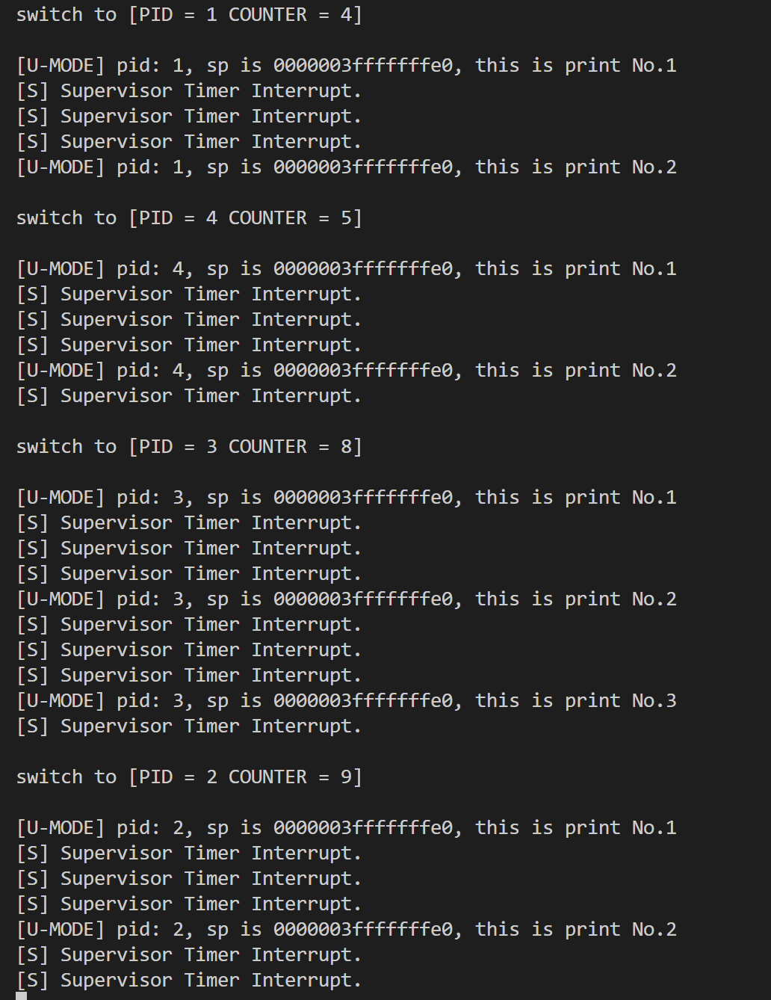
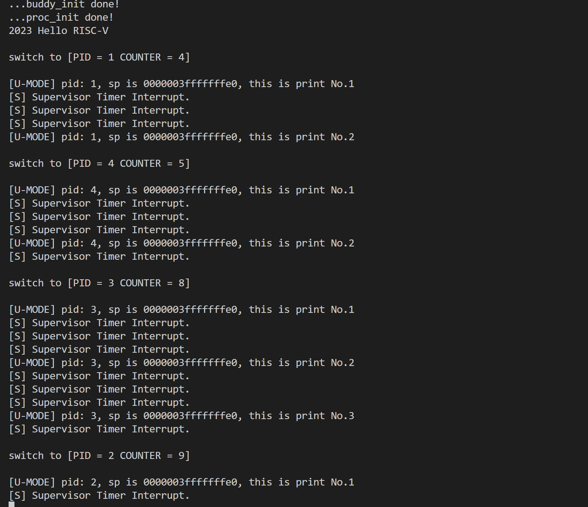

<br/>
<br/>
<br/>
<br/>
<br/>
<br/>
<br/>
<br/>
<br/>
<br/>
<br/>
<br/>

<center>
<center><font face="黑体" size = 100>
    《操作系统原理》实验报告
  </font></center>
  <br/>
<br/>
<br/>
<br/>
<br/>
<br/>
  <center><font face="黑体" size = 5>
    姓名：韩艺轩
  </font></center>
  <center><font face="黑体" size = 5>
    学院：计算机科学与技术学院
  </font></center>
  <center><font face="黑体" size = 5>
    专业：计算机科学与技术（图灵班）
  </font></center>
  <center><font face="黑体" size = 5>
    邮箱：2674361965@qq.com
  </font></center> 
  <center><font face="黑体" size = 5>
    指导教师：申文博
  </font></center>
</center>

<center>
<font face="黑体" size = 5>
    报告日期: 2023/12/9
  </font>
</center> 

<div STYLE="page-break-after: always;"></div>
<!-- TOC -->

- [Lab4-RV64 用户态程序](#lab4-rv64-用户态程序)
  - [实验步骤](#实验步骤)
  - [创建用户态进程](#创建用户态进程)
  - [添加系统调用](#添加系统调用)
  - [修改head.S和start\_kernel()](#修改heads和start_kernel)
  - [测试二进制文件](#测试二进制文件)
  - [添加ELF支持](#添加elf支持)
  - [思考题](#思考题)

<!-- /TOC -->

<div STYLE="page-break-after: always;"></div>


# Lab4-RV64 用户态程序

## 实验步骤

- 修改 vmlinux.lds，将用户态程序 uapp 加载至 .data 段。按如下修改：
```
...
.data : ALIGN(0x1000){
        _sdata = .;

        *(.sdata .sdata*)
        *(.data .data.*)

        _edata = .;

        . = ALIGN(0x1000);
        _sramdisk = .;
        *(.uapp .uapp*)
        _eramdisk = .;
        . = ALIGN(0x1000);

    } >ramv AT>ram

...
```

- 修改 defs.h，在 defs.h 添加如下内容：
```c
#define USER_START (0x0000000000000000) // user space start virtual address
#define USER_END   (0x0000004000000000) // user space end virtual address
```

- 从 repo 同步以下文件和文件夹

```
.
├── arch
│   └── riscv
│       └── Makefile
│       └── include
│           └── mm.h
│           └── stdint.h
│       └── kernel
│           └── mm.c
├── include
│   └── elf.h (this is copied from newlib)
└── user
    ├── Makefile
    ├── getpid.c
    ├── link.lds
    ├── printf.c
    ├── start.S
    ├── stddef.h
    ├── stdio.h
    ├── syscall.h
    └── uapp.S
```

- 修改根目录下的 Makefile, 将 user 纳入工程管理。

## 创建用户态进程

创建 4 个用户态进程

```c
#define NR_TASKS  (1 + 4)
```

由于创建用户态进程要对 sepc sstatus sscratch 做设置，我们将其加入 thread_struct 中。
```c
struct thread_struct {
    uint64 ra;
    uint64 sp;
    uint64 s[12];
    uint64 sepc; 
    uint64 sstatus;
    uint64 sscratch; 
};
```

由于多个用户态进程需要保证相对隔离，因此不可以共用页表。为每个用户态进程都创建一个页表。
```c
struct task_struct {
    struct thread_info* thread_info;
    uint64_t state;
    uint64_t counter;
    uint64_t priority;
    uint64_t pid;

    struct thread_struct thread;

    pagetable_t pgd;
};
```

修改 task_init，首先给每个进程初始化sepc, sstatus, scratch.将sepc设置为USER_START.并且将sstatus的SPP设置为0，使得 sret 返回至 U-Mode，将SPIE设置为1，sret 之后开启中断，SUM设置为1，S-Mode 可以访问 User 页面。sscatch保存用户态栈指针，设置成 USER_END.
```c
        task[i]->thread.sepc = USER_START;
        task[i]->thread.sstatus = csr_read(sstatus);
        task[i]->thread.sstatus = task[i]->thread.sstatus & ~(1 << 8);
        task[i]->thread.sstatus = task[i]->thread.sstatus | (1 << 5);
        task[i]->thread.sstatus = task[i]->thread.sstatus | (1 << 18);
        task[i]->thread.sscratch = USER_END ;
```

对于每个进程，创建属于它自己的页表。为了避免 U-Mode 和 S-Mode 切换的时候切换页表，我们将内核页表 （ swapper_pg_dir ） 复制到每个进程的页表中。
```c
        task[i]->pgd = (pagetable_t)kalloc();
        memcpy(task[i]->pgd,swapper_pg_dir,PGSIZE);
```

其中memcpy写在string.h中
```c
void *memcpy(void *dst, void *src, unsigned long n) {
    char *cdst = (char *)dst;
    char *csrc = (char *)src;
    for (unsigned long i = 0; i < n; ++i) 
        cdst[i] = csrc[i];

    return dst;
}
```

将 uapp 所在的页面映射到每个进行的页表中.将二进制文件拷贝到一块某个进程专用的内存之后再进行映射，防止所有的进程共享数据，造成预期外的进程间相互影响。
```c
        uint64 pagenums = ((uint64)_eramdisk-(uint64)_sramdisk);
        if(pagenums % PGSIZE == 0) pagenums /= PGSIZE;
        else pagenums = pagenums / PGSIZE + 1;
        char *temp = (char *)alloc_pages(pagenums);
        for(uint64 j = 0;j<pagenums*PGSIZE;j++){
            temp[j] = _sramdisk[j];
        }
        create_mapping(task[i]->pgd,USER_START,(uint64)temp-PA2VA_OFFSET,pagenums*PGSIZE,0x1f);
```

设置用户态栈，并映射到进程的页表中。
```c
        task[i]->thread_info.kernel_sp = (uint64)task[i] + PGSIZE;
        task[i]->thread_info.user_sp = USER_END;
        create_mapping(task[i]->pgd, USER_END-PGSIZE, (uint64)(alloc_page())-PA2VA_OFFSET,PGSIZE,0x17);
```

修改 __switch_to， 加入 保存/恢复 sepc sstatus sscratch 以及 切换页表的逻辑,切换了页表之后，需要通过 fence.i 和 vma.fence 来刷新 TLB 和 ICache.
```
    ......
	csrr t1, sepc
	sd t1, 160(a0)
	csrr t1, sstatus
	sd t1, 168(a0)
	csrr t1, sscratch
	sd t1, 176(a0)
    ......
    	ld t1, 160(a1)
	csrw sepc, t1
	ld t1, 168(a1)
	csrw sstatus, t1
	ld t1, 176(a1)
	csrw sscratch, t1
	ld t0, 184(a1)
	li t1, 0xffffffdf80000000
    sub t0, t0, t1
	srli t0, t0, 12
    li t1, 8
    slli t1, t1, 60
    or t0, t0, t1

    csrw satp, t0
    	sfence.vma zero, zero
    fence.i

	ret
```

修改 __dummy。thread_struct.sp 保存了 S-Mode sp， thread_struct.sscratch 保存了 U-Mode sp， 因此在 S-Mode -> U->Mode 的时候，我们只需要交换对应的寄存器的值即可。
```
__dummy:
	csrr t0, sscratch
	csrw sscratch, sp
	mv sp, t0
	sret
```

修改 _trap.在 _trap 的首尾我们都需要做类似的操作。如果是 内核线程( 没有 U-Mode Stack ) 触发了异常，则不需要进行切换。（内核线程的 sp 永远指向的 S-Mode Stack， sscratch 为 0）,加入判断程序，来避免不需要执行的指令被执行。另外需要讲trap_handler的第三个参数传给函数。
```
_traps:
	csrr t0, sscratch
	beq t0, x0, _traps_begin
	csrw sscratch, sp
	mv sp, t0

_traps_begin:
	addi sp, sp, -272
	sd x0, 0(sp)
	
  (......)
  
	csrr t0, sepc
	sd t0, 256(sp)
	csrr t0, sstatus
	sd t0, 264(sp)

	csrr a0, scause
	csrr a1, sepc
	mv a2, sp
	call trap_handler

  ld x0, 0(sp)
  
  (......)
	
  ld t0, 256(sp)
	csrw sepc, t0
	ld t0, 264(sp)
	csrw sstatus, t0
	ld x2, 16(sp)
	addi sp, sp, 272

	csrr t0, sscratch
	beq t0, x0, _traps_return
	csrw sscratch, sp
	mv sp, t0

_traps_return:
  sret
```

## 添加系统调用

修改trap_handler，增加用户态系统调用的逻辑。

```c
if((scause&(temp<<63))!=(temp<<63) && (scause&8UL)==8UL){
        syscall(regs);
        // printk("[U] User Environment Call.\n");
    }
```

实现系统调用函数,并且手动 pc+4。
```c
extern struct task_struct* current;

void syscall(struct pt_regs *regs){
    regs->sepc += 4;
    if (regs->reg[17] == SYS_WRITE){
        if(regs->reg[10] == 1){
            regs->reg[10] = printk((char *)(regs->reg[11]));
        }
    }else if(regs->reg[17] == SYS_GETPID){
        regs->reg[10] = current->pid;
    }
}
```

## 修改head.S和start_kernel()

在 start_kernel 中调用 schedule() 放置在 test() 之前。
将 head.S 中 enable interrupt sstatus.SIE 逻辑注释，确保 schedule 过程不受中断影响。

## 测试二进制文件

能够实现用户态的系统调用。


## 添加ELF支持

实现函数 load_program(),总体逻辑和二进制文件时没有区别，不同的是需要通过`uint64_t phdr_start = (uint64_t)ehdr + ehdr->e_phoff; uint64 seg_start = ((uint64)_sramdisk + phdr->p_offset);`来找到想要写入内存的部分地址。值得注意的是 phdr->vaddr 并不一定是某一页的开始，但我们在 create_mapping()映射的时候是一页一页的映射的，所以就要求我们能够对齐，也就是说将ELF文件的内容拷贝到特定的内存时，不能从一页的起点开始，必须留出与phdr->vaddr相同的偏移量。

```c
static uint64_t load_program(struct task_struct* task) {
    Elf64_Ehdr* ehdr = (Elf64_Ehdr*)_sramdisk;
    uint64_t phdr_start = (uint64_t)ehdr + ehdr->e_phoff;
    int phdr_cnt = ehdr->e_phnum;
    Elf64_Phdr* phdr;
    int load_phdr_cnt = 0;
    for (int i = 0; i < phdr_cnt; i++) {
        phdr = (Elf64_Phdr*)(phdr_start + sizeof(Elf64_Phdr) * i);
        if (phdr->p_type == PT_LOAD) {
            uint64 seg_start = ((uint64)_sramdisk + phdr->p_offset);
            uint64 offset = phdr->p_vaddr % PGSIZE;
            uint64 pagenums = phdr->p_memsz + offset;
            if(pagenums % PGSIZE == 0) pagenums /= PGSIZE;
            else pagenums = pagenums / PGSIZE + 1 ;
            char *temp = (char *)alloc_pages(pagenums);
            memcpy((void*)((uint64)temp+offset), (void*)seg_start, phdr->p_memsz);
            if(phdr->p_memsz>phdr->p_filesz)
                memset((void*)((uint64)temp+offset+phdr->p_filesz),0x0,phdr->p_memsz-phdr->p_filesz);
            create_mapping(task->pgd, phdr->p_vaddr, (uint64)temp-PA2VA_OFFSET,pagenums*PGSIZE, 0x1f);
            load_phdr_cnt++;
        }
    }

    task->thread_info.kernel_sp = (uint64)task + PGSIZE;
    task->thread_info.user_sp = USER_END;
    create_mapping(task->pgd, USER_END-PGSIZE, (uint64)(alloc_page())-PA2VA_OFFSET,PGSIZE,0x17);

    task->thread.sepc = ehdr->e_entry;
    task->thread.sstatus = csr_read(sstatus);
    task->thread.sstatus = task->thread.sstatus & ~(1 << 8);
    task->thread.sstatus = task->thread.sstatus | (1 << 5);
    task->thread.sstatus = task->thread.sstatus | (1 << 18);
    task->thread.sscratch = USER_END;
    return ;
}
```

修改 task_init()
```c
void task_init() {
    test_init(NR_TASKS);

    idle = (struct task_struct *)kalloc();
    idle->state = TASK_RUNNING;
    idle->counter = 0;
    idle->priority = 0;
    idle->pid = 0;
    current = idle;
    task[0] = idle;

    for(uint64 i = 1;i<NR_TASKS;i++){
        task[i] = (struct task_struct *)kalloc();
        task[i]->state = TASK_RUNNING;
        task[i]->counter  = task_test_counter[i];
        task[i]->priority = task_test_priority[i];
        task[i]->pid = i;
        task[i]->thread.ra = (uint64)__dummy ;
        task[i]->thread.sp = (uint64)task[i] + PGSIZE ;
        task[i]->pgd = (pagetable_t)kalloc();
        memcpy(task[i]->pgd,swapper_pg_dir,PGSIZE);

        load_program(task[i]);
    }
    printk("...proc_init done!\n");
}
```

运行测试通过。



## 思考题

1. 我们在实验中使用的用户态线程和内核态线程的对应关系是怎样的？（一对一，一对多，多对一还是多对多）
```
是多对一的关系，多个用户态线程对应同一个内核态线程。每个用户态进程执行自己的系统调用，都对应着同一个内核态的系统调用。
```

2. 为什么 Phdr 中，p_filesz 和 p_memsz 是不一样大的？

```
p_filesz字段对应于文件中该段的大小，而p_memsz字段则是该段在内存中的大小。 p_memsz大于p_filesz的原因是，可加载段可能包含.bss节，该节包含未初始化的数据。将此数据存储在磁盘上会很浪费，因此，仅在ELF文件加载到内存后才占用空间。
```

3. 为什么多个进程的栈虚拟地址可以是相同的？用户有没有常规的方法知道自己栈所在的物理地址？

```
对于用户态进程来说栈虚拟地址可以是相同的，因为每个进程都有自己的虚拟地址空间，对于每个进程来说，他们都拥有整个虚拟空间，但对于操作系统来说，每个用户态进程的虚拟空间都会被映射到不同的物理地址，举个简单的例子，用户A的虚拟地址a和用户B的虚拟地址b，可能在数值上 a=b,但是操作系统会将a和b映射到不同的物理地址上。这些操作对于用户来说都是“看不到的”,这样就能让用户之间互不干扰。对于栈虚拟地址来说也是这个道理。

内核给用户提供了一个接口，叫pagemap，这个接口与硬件的体系架构无关。在/proc/pid/下面有个文件叫pagemap，它会给每个page，生成了一个64bit的描述符，来描述虚拟地址这一页对应的物理页帧号或者SWAP里面的偏移量。取得了页帧号，乘以PGSIZE得到这页起始的物理地址，之后加上virtaddr % page_size的页内偏移，得到最终的物理地址。
```