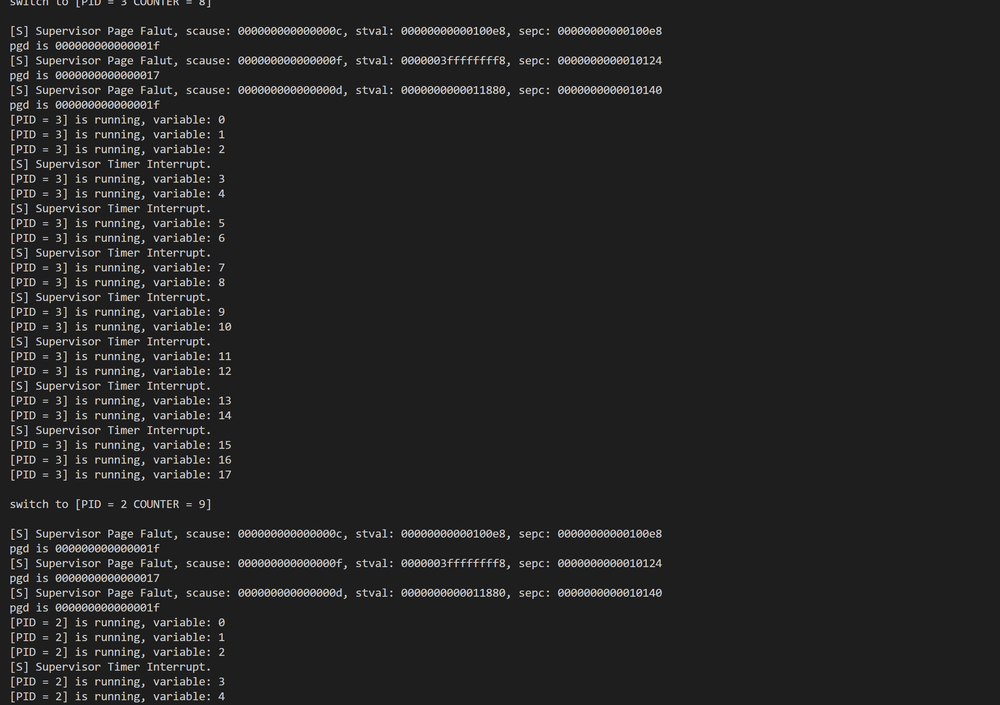

<br/>
<br/>
<br/>
<br/>
<br/>
<br/>
<br/>
<br/>
<br/>
<br/>
<br/>
<br/>

<center>
<center><font face="黑体" size = 100>
    《操作系统原理》实验报告
  </font></center>
  <br/>
<br/>
<br/>
<br/>
<br/>
<br/>
  <center><font face="黑体" size = 5>
    姓名：韩艺轩
  </font></center>
  <center><font face="黑体" size = 5>
    学院：计算机科学与技术学院
  </font></center>
  <center><font face="黑体" size = 5>
    专业：计算机科学与技术（图灵班）
  </font></center>
  <center><font face="黑体" size = 5>
    邮箱：2674361965@qq.com
  </font></center> 
  <center><font face="黑体" size = 5>
    指导教师：申文博
  </font></center>
</center>

<center>
<font face="黑体" size = 5>
    报告日期: 2023/12/21
  </font>
</center> 

<div STYLE="page-break-after: always;"></div>
<!-- TOC -->

- [Lab5 - RV64 缺页异常处理](#lab5---rv64-缺页异常处理)
  - [实验步骤](#实验步骤)
    - [准备工作](#准备工作)
    - [实现VMA](#实现vma)
      - [实现 `Demand Paging`](#实现-demand-paging)
      - [实现 Page Fault 的检测与处理](#实现-page-fault-的检测与处理)
  - [实验结果](#实验结果)
  - [思考题](#思考题)

<!-- /TOC -->

<div STYLE="page-break-after: always;"></div>


# Lab5 - RV64 缺页异常处理

## 实验步骤

### 准备工作

从 repo 同步以下文件夹: user 并按照以下步骤将这些文件正确放置。
```
.
└── user
    ├── Makefile
    ├── getpid.c
    ├── link.lds
    ├── printf.c
    ├── start.S
    ├── stddef.h
    ├── stdio.h
    ├── syscall.h
    └── uapp.S
```

### 实现VMA

#### 实现 `Demand Paging`

修改 `proc.h`，增加如下相关结构：
```cpp
#define VM_X_MASK         0x0000000000000008
#define VM_W_MASK         0x0000000000000004
#define VM_R_MASK         0x0000000000000002
#define VM_ANONYM         0x0000000000000001

struct vm_area_struct {
    uint64_t vm_start;         
    uint64_t vm_end
    uint64_t vm_flags
    uint64_t vm_content_offset_in_file;
    uint64_t vm_content_size_in_file;
};

struct task_struct {
    uint64_t state;    
    uint64_t counter; 
    uint64_t priority; 
    uint64_t pid;    

    struct thread_struct thread;
    pagetable_t pgd;

    uint64_t vma_cnt;                       
    struct vm_area_struct vmas[0];          
};
```

为了减少 task 初始化时的开销，我们对一个 Segment 或者 用户态的栈 只需分别建立一个 VMA。

首先要实现一个新建`VMA`的函数---`do_mmap`.
```cpp
void do_mmap(struct task_struct *task, uint64 addr, uint64 length, uint64 flags,
    uint64 vm_content_offset_in_file, uint64 vm_content_size_in_file){
        struct vm_area_struct temp;
        temp.vm_start = addr;
        temp.vm_end = addr + length;
        temp.vm_flags = flags;
        temp.vm_content_offset_in_file = vm_content_offset_in_file;
        temp.vm_content_size_in_file = vm_content_size_in_file;
        task->vmas[task->vma_cnt ++] = temp;
}
```


修改 `load_program` 函数代码，更改为 `Demand Paging`。Lab4 中已经实现了`load_program`,新建VMA的操作放在其中。值得注意的是，Segment中的p_flags是`R-W-X`，而`VMA`需要的是`X-W-R-A`,所以需要调整一下`bit`的顺序.
```cpp
uint64 p = 0UL;
if(phdr->p_flags & (1UL) == 1) p = p | VM_X_MASK;
if((phdr->p_flags & (1UL << 1)) >> 1 == 1) p = p | VM_W_MASK;
if((phdr->p_flags & (1UL << 2)) >> 2 == 1) p = p | VM_R_MASK;
do_mmap(task, phdr->p_vaddr, phdr->p_memsz, p, phdr->p_offset, phdr->p_filesz);
```

对于用户栈来说，需要设置权限为`VM_ANONYM | VM_W_MASK | VM_R_MASK`
```cpp
do_mmap(task, USER_END-PGSIZE, PGSIZE, VM_ANONYM | VM_W_MASK | VM_R_MASK, 0, 0);
```

对两个区域建立`VMA`:
- 代码和数据区域：该区域从 ELF 给出的 Segment 起始用户态虚拟地址 phdr->p_vaddr 开始，对应文件中偏移量为 phdr->p_offset 开始的部分
- 用户栈：范围为 [USER_END - PGSIZE, USER_END) ，权限为 VM_READ | VM_WRITE, 并且是匿名的区域。

```cpp
static uint64_t load_program(struct task_struct* task) {
    Elf64_Ehdr* ehdr = (Elf64_Ehdr*)_sramdisk;

    uint64_t phdr_start = (uint64_t)ehdr + ehdr->e_phoff;
    int phdr_cnt = ehdr->e_phnum;

    Elf64_Phdr* phdr;
    int load_phdr_cnt = 0;
    for (int i = 0; i < phdr_cnt; i++) {
        phdr = (Elf64_Phdr*)(phdr_start + sizeof(Elf64_Phdr) * i);
        if (phdr->p_type == PT_LOAD) {
            uint64 p = 0UL;
            if(phdr->p_flags & (1UL) == 1) p = p | VM_X_MASK;
            if((phdr->p_flags & (1UL << 1)) >> 1 == 1) p = p | VM_W_MASK;
            if((phdr->p_flags & (1UL << 2)) >> 2 == 1) p = p | VM_R_MASK;
            do_mmap(task, phdr->p_vaddr, phdr->p_memsz, p, phdr->p_offset, phdr->p_filesz);
            load_phdr_cnt++;
        }
    }

    do_mmap(task, USER_END-PGSIZE, PGSIZE, VM_ANONYM | VM_W_MASK | VM_R_MASK, 0, 0);
    task->thread.sepc = ehdr->e_entry;
    task->thread.sstatus = csr_read(sstatus);
    task->thread.sstatus = task->thread.sstatus & ~(1 << 8);
    task->thread.sstatus = task->thread.sstatus | (1 << 5);
    task->thread.sstatus = task->thread.sstatus | (1 << 18);
    task->thread.sscratch = USER_END;
    return load_phdr_cnt;
}
```

#### 实现 Page Fault 的检测与处理

对于`Page Fault`,有三种不同的`Page Fault`.对于`scause`的值来说。

|**Interrupt**|**Exception Code**|**Description**|
|:---:|:---:|:---:|
|0|0xc|Instruction Page Fault|
|0|0xd|Load Page Fault|
|0|0xf|Store/AMO Page Fault|


- 修改 trap.c, 添加捕获 `Page Fault` 的逻辑.遇到`Page Fault`,就转到`do_page_fault`处理它。

```cpp
void trap_handler(unsigned long scause, unsigned long sepc, struct pt_regs *regs) {
    unsigned long temp = 1;
	if(scause == 0x8000000000000005){
	    clock_set_next_event();

        do_timer();
        
        printk("[S] Supervisor Timer Interrupt.\n");
	}else if(scause == 8UL){
        syscall(regs);
        printk("[U] User Environment Call.\n");
    }else if(scause == 0xc | scause == 0xd | scause == 0xf){
        printk("[S] Supervisor Page Falut, ");
        printk("scause: %lx, ", scause);
        printk("stval: %lx, ", regs->stval);
        printk("sepc: %lx\n", regs->sepc);
        do_page_fault(regs);
    }else{
        printk("[S] Unhandled trap, ");
        printk("scause: %lx, ", scause);
        printk("stval: %lx, ", regs->stval);
        printk("sepc: %lx\n", regs->sepc);
        while (1);
    }
}
```

然后还需要实现`find_vma`来查找某个虚拟地址是否在某个`vma`中.

```cpp
struct vm_area_struct *find_vma(struct task_struct *task, uint64 addr){
    uint64 num = task->vma_cnt;
    // printk("%lx\n", num);
    // while(1);
    for(uint64 i = 0; i < num; i++){
        // printk("%lx\n", task->vmas[i].vm_start);
        if(task->vmas[i].vm_start <= addr && task->vmas[i].vm_end >= addr){
            return &(task->vmas[i]);
        }
    }

    return NULL;
}

```

最后，再正确地实现`do_page_fault`就可以了。在`do_page_fault`中首先通过 stval 获得访问出错的虚拟内存地址（Bad Address），然后通过 find_vma() 查找 Bad Address 是否在某个 vma 中，分配一个页，将这个页映射到对应的用户地址空间，再通过 (vma->vm_flags & VM_ANONYM) 获得当前的 VMA 是否是匿名空间，根据 VMA 匿名与否决定将新的页清零或是拷贝 uapp 中的内容，如果是要向新的页写入内容，还要注意内容的对齐，将`stval`所在的那一页对应的文件中的内容写入新的页中,如果有超出[vaddr, vaddr + file_size]的部分要置零，且注意页内的对齐。

```cpp
void do_page_fault(struct pt_regs *regs) {
    uint64 stvall = regs->stval;
    struct vm_area_struct *vma_temp = find_vma(current, stvall);
    if(vma_temp != NULL){
            uint64 seg_start = ((uint64)_sramdisk + vma_temp->vm_content_offset_in_file);
            uint64 PG_start = (stvall / PGSIZE) * PGSIZE;
            uint64 PG_end = PG_start + PGSIZE;
            char *temp = (char *)alloc_pages(1);
            memset((void*)temp, 0x0, PGSIZE);
            // printk("type:0.\n");
            // while (1);
            if(!(vma_temp->vm_flags & VM_ANONYM)){
                if(PG_start <= vma_temp->vm_start){
                    uint64 pre_offset = vma_temp->vm_start - PG_start;
                    if(PG_end < vma_temp->vm_start + vma_temp->vm_content_size_in_file){
                        // printk("type:1.\n");
                        // while (1);
                        memcpy((void *)((uint64)temp + pre_offset),(void*)(seg_start), PGSIZE - pre_offset);
                    }else{
                        uint64 la_offset = PG_end - (vma_temp->vm_start + vma_temp->vm_content_size_in_file);
                        memcpy((void *)((uint64)temp + pre_offset), (void*)(seg_start), PGSIZE - pre_offset - la_offset);
                    }
                }else{
                    uint64 offset = PG_start - vma_temp->vm_start;
                    if(PG_end < vma_temp->vm_start + vma_temp->vm_content_size_in_file){
                        // printk("type:3.\n");
                        // while (1);
                        memcpy((void*)(temp), (void*)(seg_start + offset), PGSIZE);
                    }else{
                        // printk("type:4.\n");
                        // while (1);
                        uint64 la_offset = PG_end - (vma_temp->vm_start + vma_temp->vm_content_size_in_file);
                        if(PG_start<vma_temp->vm_start + vma_temp->vm_content_size_in_file)
                            memcpy((void*)(temp), (void*)(seg_start + offset), PGSIZE - la_offset);
                    }
                }
            }
            printk("pgd is %lx\n", vma_temp->vm_flags | 1UL | 1UL << 4);
            create_mapping(current->pgd, (uint64)PG_start, (uint64)temp-PA2VA_OFFSET, PGSIZE, vma_temp->vm_flags | 1UL | 1UL << 4);
    }else{
        // printk("type:-1.\n");
            // while (1);
    }
}
```

## 实验结果

下面的截图中每个进程被调用了两次，main作为uapp的时候，每个进程会发生**3次**`Page Fault`.





## 思考题

1. uint64_t vm_content_size_in_file; 对应的文件内容的长度。为什么还需要这个域?

> 与`lab4`中的思考题相同，`vm_content_size_in_file`对应于文件中该段的大小，而`vm_end - vm_start`是该段在内存中的大小。 二者有不同的含义，因为可加载段可能包含.bss节，该节包含未初始化的数据。将此数据存储在磁盘或文件上会很浪费，因此，仅在ELF文件加载到内存后才占用空间。所以我们需要`vm_content_size_in_file`来标记对应的文件内容的长度，这个长度是不能用`vm_end - vm_start`来表示的。

2. `struct vm_area_struct vmas[0];` 为什么可以开大小为 0 的数组? 这个定义可以和前面的 vma_cnt 换个位置吗?

> `struct vm_area_struct vmas[0];` 定义柔性数组成员，它允许在结构体的末尾定义一个数组，但数组的大小可以是0,通常用于动态分配内存来保存可变大小的数据,因为每个进程都用了一个 PGSIZE 的大小来承载 task_struct 因此有足够的空间来让 vmas[] 动态的添加数据，但 vmas[] 必须在最后，不可以和 vma_cnt 换位置，如果换了位置，vmas[]动态添加数据的时候会与vma_cnt产生内存冲突，会覆盖掉 vma_cnt.