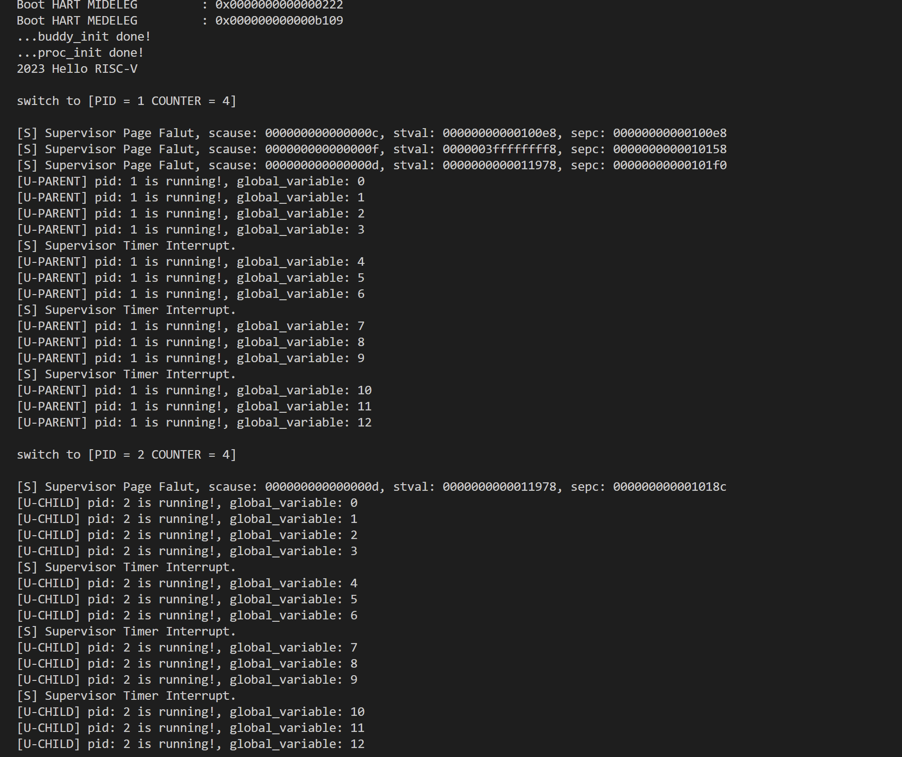
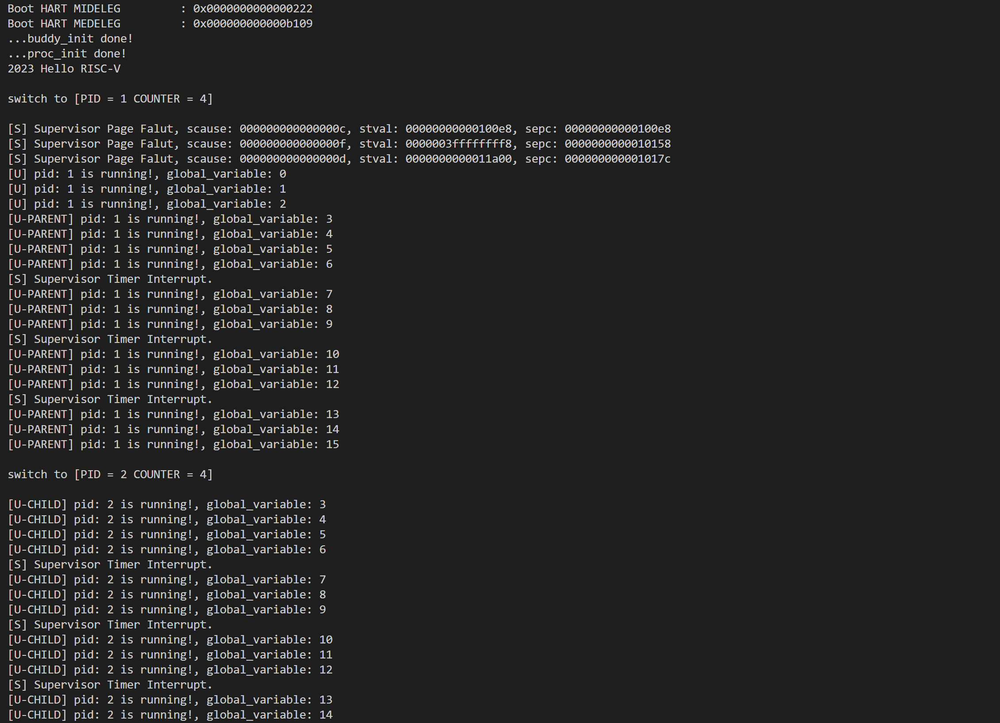
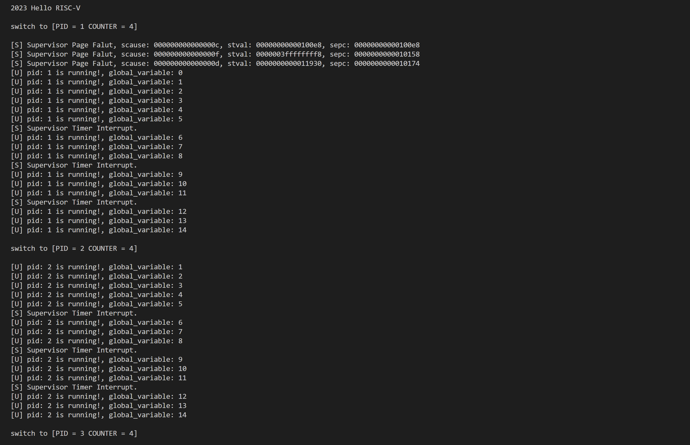
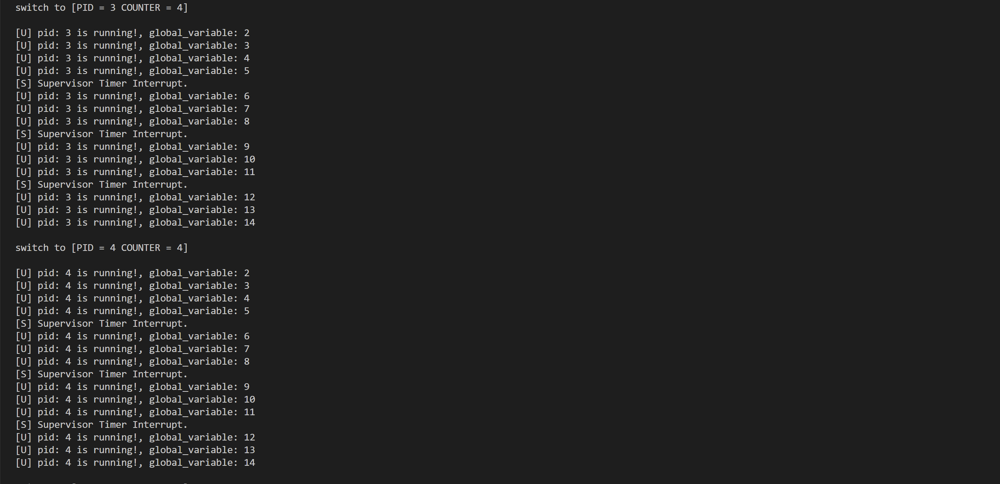

<br/>
<br/>
<br/>
<br/>
<br/>
<br/>
<br/>
<br/>
<br/>
<br/>
<br/>
<br/>

<center>
<center><font face="黑体" size = 100>
    《操作系统原理》实验报告
  </font></center>
  <br/>
<br/>
<br/>
<br/>
<br/>
<br/>
  <center><font face="黑体" size = 5>
    姓名：韩艺轩
  </font></center>
  <center><font face="黑体" size = 5>
    学院：计算机科学与技术学院
  </font></center>
  <center><font face="黑体" size = 5>
    专业：计算机科学与技术（图灵班）
  </font></center>
  <center><font face="黑体" size = 5>
    邮箱：2674361965@qq.com
  </font></center> 
  <center><font face="黑体" size = 5>
    指导教师：申文博
  </font></center>
</center>

<center>
<font face="黑体" size = 5>
    报告日期: 2023/12/22
  </font>
</center> 

<div STYLE="page-break-after: always;"></div>

<!-- TOC -->

- [Lab6 - 实现 fork 机制](#lab6---实现-fork-机制)
  - [实验步骤](#实验步骤)
    - [修改 task\_init](#修改-task_init)
    - [实现 sys\_clone](#实现-sys_clone)
    - [修改schedule](#修改schedule)
  - [实验结果](#实验结果)
    - [1](#1)
    - [2](#2)
    - [3](#3)
  - [思考题](#思考题)

<!-- /TOC -->

<div STYLE="page-break-after: always;"></div>


# Lab6 - 实现 fork 机制

## 实验步骤

### 修改 task_init

本次实验中开辟16个task，在最初的时候只初始化idle 和 task[1],其余的都为`NULL`.

```cpp
void task_init() {
    test_init(NR_TASKS);

    idle = (struct task_struct *)kalloc();
    ......
    TASK_CNT = 0;

    for(uint64 i = 1;i<NR_TASKS;i++){
        if(i > 1){
            task[i] = NULL;
        }else{
            TASK_CNT ++;
            ......
        }
    }
    printk("...proc_init done!\n");
}
```

> 其中引入一个全局变量`TASK_CNT`,代表在`Ready Queue`中的最大的index，也就是总数量-1（理论上讲把它的含义设置成总数量会更合适，但是刚开始写的时候脑子抽抽了给他赋予了这样的含义，接下来就顺着做了）。

### 实现 sys_clone

`sys_clone()`函数是实现 fork机制的最重要的部分，它完成了 子task 的建立以及内存映射等重要功能。父task 在执行用户态函数`fork()`时会执行系统调用`ecall`,进入中断处理程序，在上下文切换的前半段将寄存器和 CSRS 的信息存在用户态栈中，在处理中断处理程序中，我们能得到用户态栈的起点`pt_regs *regs`,我们能根据`regs`中`a7`的值来判断是哪一类系统调用，并通过`a0`来返回返回值。所以添加了这样的处理程序来捕获fork的系统调用。

```cpp
void syscall(struct pt_regs *regs){
    // printk("in syscall :: %lx.\n", regs->reg[17]);
    regs->sepc += 4;
    if (regs->reg[17] == SYS_WRITE){
        if(regs->reg[10] == 1){
            regs->reg[10] = printk((char *)(regs->reg[11]));
        }
    }else if(regs->reg[17] == SYS_GETPID){
        regs->reg[10] = current->pid;
    }else if(regs->reg[17] == SYS_CLONE){
        regs->reg[10] = sys_clone(regs);
    }
}
```

接下来就是实现`sys_clone`,首先需要像`task_init`里那样新建一个页，为子task的task_struct分配一个页,但在最开始需要先判断一下还有没有位置给新的进程，如果没有位置，直接返回-1给用户态。

```cpp
    if(TASK_CNT>=NR_TASKS-1) return -1;
```

新建一页,并将父task的内容拷贝下来。
```cpp
    task[++TASK_CNT] = (struct task_struct *)kalloc();
    memcpy((void *)task[TASK_CNT], (void *)current, PGSIZE);
```

修改`entry.S`中的`_traps`

```
    .global _traps
_traps:
    ...
   jal x1, trap_handler
    .global __ret_from_fork
__ret_from_fork:
    ... ;利用 sp 从栈中恢复出寄存器的值 
    sret

```

这是为了让被fork出来的子task在第一次被调度的时候，可以返回到`__ret_from_fork`，从内核态的栈上恢复出我们在 sys_clone 时拷贝到新的 task 的栈上的，原本在 context switch 时被压入父 task 的寄存器值，然后通过 sret 直接跳回用户态执行用户态程序。

所以在`sys_clone`中需要设置

```cpp
task[TASK_CNT]->thread.ra = (uint64)__ret_from_fork;
```

更新pid
```cpp
task[TASK_CNT]->pid = TASK_CNT;
```

因为跳转到`__ret_from_fork`之后需要从当时的sp上恢复内容，sp是来自`__switch_to`中子task中`thread.sp`,所以还要设置好这个值，我们需要恢复的内容，是从父task的task_struct的最高的地址往下压

```
                    ┌─────────────┐◄─── High Address
                    │             │
                    │    stack    │
                    │             │
                    │             │
              sp ──►├──────┬──────┤
                    │      │      │
                    │      ▼      │
                    │             │
                    │             │
                    │             │
                    │             │
    4KB Page        │             │
                    │             │
                    │             │
                    │             │
                    ├─────────────┤
                    │             │
                    │             │
                    │ task_struct │
                    │             │
                    │             │
                    └─────────────┘◄─── Low Address
```

对于子task来说，因为是完全DeepCopy，所以也是如此，也就是说子task的thread.sp的值应该是在子task的task_struct中，与上图中sp相同位置的值,也就是说有相同的偏移量。

```cpp
    uint64 offset = (uint64)regs - (uint64)current;
    struct pt_regs *child_pt_regs = (struct pt_regs *)((uint64)task[TASK_CNT] + offset);
    task[TASK_CNT]->thread.sp = (uint64)child_pt_regs;
```

为了能够让子task能够sret时回到用户程序并返回正确的值，修改a0和sp以及sepc

```cpp
child_pt_regs->reg[10] = 0;
    child_pt_regs->reg[2] = (uint64)child_pt_regs;
    child_pt_regs->reg[32] = regs->sepc;
```

最后剩下的工作就是完成子task内存的映射，子task作为一个新的task不能与父task共享一片物理地址空间，也就是说需要新分配地址，然后复制父task的东西，在子task诞生之际，让他的页表中有父task有的所有映射，哪怕是相同的内容，也要放在不同的物理地址，因为这是两个不同的task。

首先为子task新建一个页表，由于所有用户态进程共享内核态的资源，所以这个新页表可以通过copyswapper_pg_dir的内容完成内核的映射。
```cpp
    task[TASK_CNT]->pgd = (pagetable_t)kalloc();
    memcpy((void*)(task[TASK_CNT]->pgd), (void*)swapper_pg_dir, PGSIZE);
```

然后就是用户态的内容，为了减少开销，可以借助vma记录的内容来遍历父task的页表，来知道有哪些已经被分配映射了。具体来说，对于父task的每个vma，与他相关的所有虚拟内存空间的页都需要被检查是否被映射到了物理地址，如果被映射到了物理地址，那么子task需要也开辟新的一页来建立属于自己的映射，但是页上的内容与父task应该是完全一样的。
```cpp
    for(uint64 i = 0; i < current->vma_cnt; i++){
        uint64 PG_start = (current->vmas[i].vm_start / PGSIZE) * PGSIZE;
        uint64 last_PG = (current->vmas[i].vm_end / PGSIZE) * PGSIZE;
        for(uint64 j = PG_start;j <= last_PG; j += PGSIZE){
            uint64 vpn2 = (j >> 30) & 0x1ff;
            uint64 vpn1 = (j >> 21) & 0x1ff;
            uint64 vpn0 = (j >> 12) & 0x1ff;
            if(current->pgd[vpn2] & 0x1){
                uint64 *second = (uint64 *)(((current->pgd[vpn2] >> 10) << 12) + PA2VA_OFFSET);
                if(second[vpn1] & 0x1){
                    uint64 *third = (uint64 *)(((second[vpn1] >> 10) << 12) + PA2VA_OFFSET);
                    if(third[vpn0] & 0x1){
                        uint64 flag = (uint64)(third[vpn0]) & 0x3ff;
                        uint64 *pa = (uint64 *)(((third[vpn0] >> 10) << 12) + PA2VA_OFFSET);
                        char *temp = (char *)alloc_page();
                        memcpy((void *)temp, (void *)pa, PGSIZE);
                        create_mapping(task[TASK_CNT]->pgd, (uint64)j, (uint64)temp-PA2VA_OFFSET, PGSIZE, flag);
                    }
                }
            }
        }
    }
```

最终返回子task的pid
```cpp
    return TASK_CNT;
```

### 修改schedule

因为现在task[]数组并不全是“活”进程，所以调度时遍历的进程数需要动态的根据情况变化，将其修改为已有的“活”进程数就可以。

## 实验结果

测试的三个`main()`函数的结果如下

### 1



### 2



### 3





## 思考题

1.  *参考 task_init 创建一个新的 task，将的 parent task 的整个页复制到新创建的 task_struct 页上。* 这一步复制了哪些东西?

> 复制了task_struct的全部内容以及task_struct高地址的stack上的内容()：
> ```
>                    ┌─────────────┐◄─── High Address
>                    │             │
>                    │    stack    │
>                    │             │
>                    │             │
>              sp ──►├──────┬──────┤
>                    │      │      │
>                    │      ▼      │
>                    │             │
>                    │             │
>                    │             │
>                    │             │
>    4KB Page        │             │
>                    │             │
>                    │             │
>                    │             │
>                    ├─────────────┤
>                    │             │
>                    │             │
>                    │ task_struct │
>                    │             │
>                    │             │
>                    └─────────────┘◄─── Low Address
> ```
> 其中task_struct中包含：
> ```
> struct task_struct {
>    struct thread_info thread_info;
>    uint64 state;    // 线程状态
>    uint64 counter;  // 运行剩余时间
>    uint64 priority; // 运行优先级 1最低 10最高
>    uint64 pid;      // 线程id
>    struct thread_struct thread;
>    pagetable_t pgd;
>    uint64 vma_cnt;                       /* 下面这个数组里的元素的数量 */
>    struct vm_area_struct vmas[0];
>};
> ```

2. *将 thread.ra 设置为 __ret_from_fork，并正确设置 thread.sp。* 仔细想想，这个应该设置成什么值？可以根据 child task 的返回路径来倒推。

> 在报告中已经给出解释。子task返回的路径是`__switch_to->__ret_from_fork(in _traps)->user program`.在`__ret_from_fork`中，需要将`sp`中存储的内容恢复到上下文中，那么`sp`是什么呢，是`__switch_to`中将子task的`thread.sp`的值给到`sp`。需要恢复到上下文的东西一开始是父task遇到fork的系统调用时，trap_handler之前，将上下文压入父task的页的高地址的stack上，也就是第一个思考题中的图的`sp`以上的部分，子task是复制了父task的页，因此也有stack的全部内容，所以子task的`sp`与该页的`Low Address`的偏移量应该和父task中的相同，而且最终子task在`__ret_from_fork`中要恢复的也是这部分，所以子task的thread.sp可以这样设置：
> ```
>     uint64 offset = (uint64)regs - (uint64)current;
>     struct pt_regs *child_pt_regs = (struct pt_regs *)((uint64)task[TASK_CNT] + offset);
>     task[TASK_CNT]->thread.sp = (uint64)child_pt_regs;
> ```

3. *利用参数 regs 来计算出 child task 的对应的 pt_regs 的地址，并将其中的 a0, sp, sepc 设置成正确的值。* 为什么还要设置 sp?

> 因为在`_ret_from_fork`里，需要将`pt_regs`的值恢复到上下文中，在`pt_regs`中设置`sp`是为了使`sp`在恢复上下文时可以正确的被恢复，如果仅仅设置`child_task->thread.sp`，那么只能保证在恢复上下文时能找到这些值，但是其中`x2`的值与`child_task->thread.sp`是不一样的是冲突的，在最后
> ```
> 	ld x2, 16(sp)
> 	addi sp, sp, 288
> ```
> 时，`x2`被赋予错误的值，而`x2`和`sp`其实是同一个寄存器，也就是`sp`被改写成了错误的值（父task当时存的值），再执行`addi sp, sp, 288`时将发生错误，会造成栈空间的混乱，不能达到预期的效果。